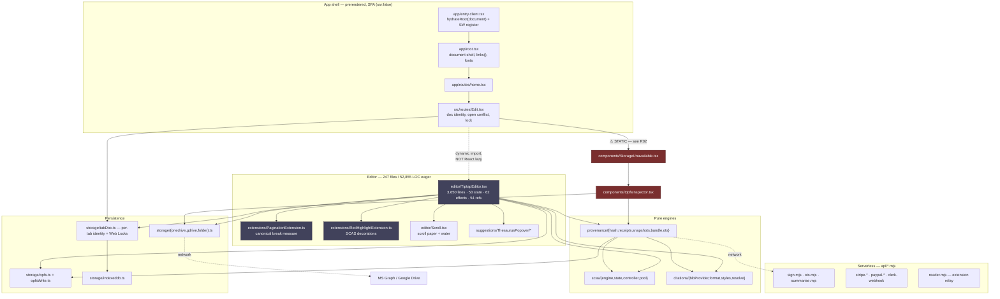

# Inkwave — refactor architecture

**Basis commit:** `3c24c2b` (`feat: complete studio file launch and image metadata UX`), branch `feat/gmail-send`,
identical to `master` and `origin/master` at the time of measurement.
**Date:** 2026-09-06 · **Author:** Claude (read-only study) · **Consumer:** Astra, staged implementation.

**Every measurement in this document was taken against a clean tree at `3c24c2b`.** Partway through the
study other lanes began editing the worktree (`src/editor/Scroll.tsx`, `src/editor/extensions/PaginationExtension.ts`,
`src/editor/suggestions/ThesaurusPopover/ThesaurusPopover.tsx`, `src/routes/SnapshotView.tsx`,
`src/routes/pageChrome.ts`, `src/styles/index.css`, `src/editor/zoom*`, and new `src/email/gmailMailbox*`,
`src/email/mailbox.ts`). Findings that touch those files are marked **⚠ DRIFTING** and must be re-checked
against the tip before implementation. No file was modified by this study; the two deliverables are new files.

**Evidence labels** are used on every substantive claim:
**MEASURED** (a repeatable measurement was run) · **TRACED** (established from the current import/call/data flow)
· **INFERRED** (plausible, not established) · **STATED-NOT-PROVED** (documented or proposed only).

---

## 1. Executive recommendation

**Fix the gate, then the guards, then the startup payload — and treat `TiptapEditor.tsx` decomposition as the
last of the large projects, not the first.** That ordering is the opposite of the instinct the file's
3,650 lines provoke, and the measurements are why.

**1. The cheapest item is also the most important, and it is four lines.** There is **no `pnpm gate` script**:
CLAUDE.md names the one correct `&&` chain and then records *three separate occasions* where an
always-succeeding step was slipped between the gate and the push, shipping two broken commits — because that
chain is retyped by hand every single time. There is also **no linter installed at all**, **no CI**, and
`api/*.mjs` resolves to **zero files** in either tsconfig (the repo's own `apiFunctionsParse.test.ts`
demonstrates that `broken syntax here (((` in the live Bitcoin-anchoring endpoint leaves the full gate green).
And `"test": "vitest"` has no `--run`, so in a TTY the gate is watch mode. **Nothing else in this document is
worth doing before that is fixed**, because nothing else can be trusted to have been checked.

Three further findings drive the plan.

**2. One import owns half the landing payload, and it is a failure-path screen.** The landing critical path is
**316.8 KB gzipped / 903 KB raw across 19 assets** (MEASURED). A single static import —
`Edit.tsx → StorageUnavailable.tsx → OpfsInspector.tsx` — pulls the provenance bundle stack, the 318 KB word
frequency list, `@citation-js/core`, and all three cloud adapters onto the first paint of every visit
(TRACED). `StorageUnavailable` renders only when a storage read has *failed*. This is the single highest
value-per-risk change available, and it needs one piece of care that is easy to miss (§9, R09).

**3. The repo's guards are unusually good and unusually narrow.** This is the study's most transferable
finding and it recurs in every audit lane. `colourScan.test.ts` never scans the stylesheet, so two custom
properties are read by `index.css` and declared nowhere in the repo, rendering a fallback grey in both themes
today (MEASURED). `touchTargets.test.ts` asserts only that certain strings appear *somewhere* in a file, so an
already-drifted `--iw-tap-x` value sits invisible to it. **Widening five existing tests is cheaper than any
consolidation on the queue and converts four live findings from prose into red** (§6.4). Do this in stage 1,
before anything moves.

**4. Measurement kills two inherited recommendations outright.** The paragraph-index and paragraph-count walks
on the transaction path — flagged as a target — cost **≈0.14 ms at 5,000 paragraphs**, against a 48 ms
keystroke budget (MEASURED). Fixing them would add a position-mapping correctness surface to `currentParagraphIndex`,
which drives popover word-stepping, in exchange for nothing. **Do not fix them.** Separately, CLAUDE.md's claim
that viewport-windowed SCAS decoration rendering was "not attempted" is **stale**: it is implemented, flagged
default-OFF, and unit-pinned (TRACED). What it lacks is not code but a browser measurement and one coordinate
check.

The corollary for the largest file: `TiptapEditor.tsx` is genuinely mixed-responsibility and does need
decomposition, but **extracting hooks from it will not reduce a single re-render.** All 53 `useState` remain in
one component, and there is exactly **one `React.memo` in the entire codebase** (MEASURED). A decomposition
that moves lines into hook files buys readability and costs lines — the last four extractions in this repo were
net **+598**. The version that buys performance moves *state ownership* down into components or external
stores. Those are different projects with different risk, and the plan separates them.

**What this study does not authorise.** Twelve decisions were Peter's, not mine. **Five were ruled on 2026-09-06 and are folded into the plan** (§12):
fix the snapshot pane's reference-list break, do **not** consolidate the three break rules, drop the lite
export, fix the z-index ties, and take the conservative probe cut. Seven remain open.

**One thing found in passing that is not a refactor item at all:** the study surfaced **nine live bugs** on
`master`, two of them in the data-loss family that has already cost Peter six incidents. They are listed first,
in §6.0, and should be fixed on their merits ahead of any restructuring.

---

## 2. Measured current-state inventory

### 2.1 Scale

| | files | lines |
|---|---|---|
| `src/` TypeScript/TSX total | 617 | 117,734 |
| production (excl. `*.test.*`) | 359 | ~99,000 |
| tests | 258 | ~37,000 |
| test suite result at basis commit | 259 files | 3,160 passed, 2 skipped, 30.5 s |

`pnpm typecheck` **PASS** · `pnpm test` **PASS** · `pnpm build` **exit 0, 4.78 s** (all MEASURED at `3c24c2b`).

### 2.2 Production vs test lines by area

The ratio is the story: the two largest areas are the two thinnest-tested, and they are exactly the areas the
refactor must touch.

| area | prod lines | prod files | test lines | test files | test:prod |
|---|---|---|---|---|---|
| `editor` | 26,012 | 90 | 6,039 | 47 | **0.23** |
| `components` | 19,047 | 66 | 4,097 | 33 | **0.22** |
| `music` | 8,701 | 40 | 6,347 | 31 | 0.73 |
| `productivity` | 7,294 | 37 | 6,948 | 32 | 0.95 |
| `routes` | 5,108 | 11 | 727 | 4 | **0.14** |
| `storage` | 3,437 | 18 | 2,082 | 16 | 0.61 |
| `styles` | 3,165 | 2 | 1,009 | 7 | 0.32 |
| `citations` | 2,982 | 29 | 1,629 | 17 | 0.55 |
| `provenance` | 2,181 | 15 | 1,968 | 19 | 0.90 |
| `reader` | 1,675 | 14 | 2,239 | 17 | 1.34 |
| `verify` | 982 | 5 | 413 | 4 | 0.42 |
| `scas` | 946 | 9 | 894 | 8 | 0.94 |
| `email` | 856 | 9 | 1,089 | 9 | 1.27 |

**The provenance spine, SCAS and storage — the parts that can lose Peter's thesis — are the well-tested parts.
The editor surface, the components and the routes are not.** Any decomposition of `editor`/`components`/`routes`
is therefore a decomposition without a net, and §9 requires characterization tests written *before* each move.

### 2.3 Startup payload (MEASURED)

Landing route `/`, production build, gzipped:

| asset | raw | gzip | note |
|---|---|---|---|
| `bundle-*.js` | 399.7 KB | **159.7 KB** | **50% of the critical path** — see §5.1 |
| `index-*.js` | 131.6 KB | 42.3 KB | |
| `chunk-*.js` | 125.5 KB | 42.3 KB | vendor |
| `Scroll-*.js` | 59.3 KB | 19.0 KB | includes the generated wave scene |
| `index-*.css` | 85.4 KB | 17.7 KB | |
| `home-*.js` | 31.4 KB | 10.3 KB | |
| `onedrive-*.js` | 24.2 KB | 7.2 KB | cloud adapter on first paint |
| `snapshots-*.js` | 13.6 KB | 5.2 KB | |
| 11 smaller assets | | 12.1 KB | |
| **total** | **903 KB** | **316.8 KB** | 19 assets |

Largest built chunks overall: `MusicPanel` 1,279 KB, `mathlive.min` 806 KB, `Toast` 720 KB, `index` 527 KB,
`pdf` 466 KB, `TiptapEditor` 455 KB. Total `build/client` 28 MB (dominated by fonts, pdf.js assets and media).

### 2.4 Reachability (TRACED, via static value-import graph)

| entry | eager files | eager lines |
|---|---|---|
| client shell (`entry.client` + `root` + `routes/home`) | 68 | 14,694 |
| `TiptapEditor.tsx` | **247** | **52,855** |

`TiptapEditor` therefore reaches **45% of all `src/` lines** in one eager graph, behind 11 dynamic boundaries.
The correctly-lazy ones are `MusicPanel`, `MusicStudio`, `ProductivityGraphsPanel`, `ProductivityReportModal`,
`textRenderProbe`, `breakTableDebug`, and `productivity/{demo,installSource,ledgerRemotes}`.

**Already correct, do not "fix":** `pdfjs-dist` is properly lazy behind `citations/pdfjsSetup.ts` (dynamic
`import('pdfjs-dist')`), so the 466 KB pdf chunk does **not** ride the editor payload. `TiptapEditor` itself is
already behind a dynamic import that is deliberately **not** `React.lazy`/`Suspense` — `Edit.tsx` holds the
module in state, per the double-mount invariant. Do not convert it.

### 2.5 Guard inventory (MEASURED)

- **41 test files read source files from disk** — path-keyed guards that break silently or noisily when a file moves.
- Most-pinned paths: `src/styles/index.css` (**10 tests**), `src/entrypoints/*` (3 each), `src/editor/TiptapEditor.tsx` (3), `src/routes/SnapshotView.tsx` (2), `src/music/{types,flag}.ts` (2 each), `src/components/SyncStatus.tsx` (2), `src/citations/styles.ts` (2).
- **81 of 81 `prove:*` package scripts point at files that exist** — no dangling targets.
- Named invariant guards exist and are well-shaped in `provenance/` (`archiveReadFail`, `staleCacheTruncation`, `mergeSnapshots`, `noAutoDelete`, `multiKeyVerify`), `storage/` (`openConflict`, `singleOpen`, `tabDoc.locks`, `openDocArchiveFail`, `cloudLocalRead`) and `scas/` (`engine`, `state`, `controller.window`, `poolId`).

---

## 3. Current architecture

### 3.1 Subsystem dependency diagram



Solid arrows are **static value imports** (they ship together); dotted arrows are **dynamic imports or
network calls**. The two red nodes are the failure-path recovery screens that today sit on the first paint of
every visit.

### 3.2 Sequence: edit → autosave → snapshot → OTS → mirror

```mermaid
sequenceDiagram
  autonumber
  participant K as Keystroke
  participant PM as ProseMirror
  participant SC as SCAS controller
  participant RH as RedHighlight
  participant TE as TiptapEditor
  participant OP as OPFS
  participant SN as snapshots.ts
  participant NET as api/sign + OTS calendar
  participant CL as OneDrive / Drive / folder

  Note over K,RH: SYNCHRONOUS with the keystroke — budget ~48 ms measured
  K->>PM: handleKeyDown (kd-sync: plain printable keys dispatched synchronously)
  PM->>TE: onTransaction — paragraph index walk (0.14 ms @5k paras, MEASURED)
  PM->>RH: docChanged → DecorationSet rebuild (windowing flag default OFF)

  Note over SC,OP: DEFERRED main thread — debounced, never on the keystroke
  PM-->>SC: scanCommitted (120 ms tick, per-paragraph WeakMap cache)
  PM-->>TE: 200 ms autosave debounce
  TE->>OP: saveDocument — THE single write funnel (freeze point for take-over)
  PM-->>TE: 150 ms desktop pause → PaginationExtension.recompute()
  Note right of TE: canonical measure in a forced context,<br/>single rAF, no-paint window

  Note over SC,NET: EXPLICIT PATH — only on a resolved kick with a changed contentHash
  SC->>SN: resolved kick → snapshot
  SN->>OP: read archive → mergeSnapshots (grow-only) → gzip → write
  Note right of SN: ⚠ re-read is gated on byte SIZE;<br/>a failed re-read ABANDONS the write
  SN->>NET: sign + OTS stamp on creation
  Note right of NET: sweep on ReceiptPanel OPEN only,<br/>throttled 15 min — never on load

  Note over CL: MIRROR — takes the array it is handed, does NOT re-read
  TE->>CL: oneDriveWriteNow (local-read check here is load-bearing)
```

**Reading the diagram as a budget:** work above the first `Note` is charged to the writer's keystroke; work in
the second block is charged to a pause; work in the third block happens a few times an hour. Any refactor that
moves a box upward is a regression regardless of how much tidier the code reads — this is the invariant behind
"no O(document) work may be moved onto a keystroke merely to make code look simpler."

---

## 4. Responsibility and dependency map

### 4.1 `TiptapEditor.tsx` — the composition root that became a god object

**MEASURED at `3c24c2b`:** 3,650 lines · 99 imports across 13 `src/` areas · 53 `useState` · 62 `useEffect` ·
2 `useLayoutEffect` · 54 `useRef` · 2 `useCallback`. One component function spans lines 142–3,640. The JSX
return begins at line **3,054** and renders **27 child components** — so **~2,900 lines are hooks, effects and
handlers, and ~590 lines are markup.**

The children are *already* extracted. The problem was never the markup.

**Nameable responsibilities** (the REFACTOR-QUEUE §3 test — one phrase, no "part 1"/"the rest"):

| # | responsibility | approximate state it owns |
|---|---|---|
| 1 | Cloud sync orchestration | `oneDriveAcct, lastSync, fileName, lastFileSave, oneDriveUrl, gdriveActive, lastGdriveSync, gdriveUrl, otherDevice, conflictDismissed, needsReconnect, unsynced, unsyncedNow` + 7 refs |
| 2 | Footer toolbar slot model and drag | `toolbarSlots, toolbarPickerOpen, altHeld, slotDragView, popupDragTarget, popupDragActive, barsAnimating, activeBar` + 11 refs |
| 3 | Mobile keyboard and footer reserve geometry | `keyboardUp, paperRight, lineHeight` + `vvSettledRef, kbMaxRef, lastPmReserveRef, keepCaretRef, footerRef, footerWrapRef` |
| 4 | Snapshot accrual and receipt chain | `snapshots, receipts, chainStatus` + `snapQueueRef, sessionRef, priorReceiptsRef, periodKicksRef, cadenceTapRef` |
| 5 | SCAS tick scheduling | `currentParagraphIndex` + `scasRef, scasTickTimerRef, scasEngineOffRef, scasHadDeletionRef, scasWinRef, scasLastCaretRef, prevDocSizeRef, prevParaCountRef` |
| 6 | Panel visibility registry | `receiptOpen, syncOpen, verifyOpen, reportOpen, bibPanelOpen, ledgerOpen, graphsOpen, oppsOpen, emailSurfaceMode` |
| 7 | Cloud file/folder picker choreography | `folderPickerOpen, gdrivePickerOpen, odOpenerOpen, gdriveOpenerOpen, fileOpenError` |
| 8 | Reveal choreography | `settled, waveRest, chromeDone, barsAnimating` |
| 9 | Citation and bibliography surface | `citationStyle, bibPanelStartsNew, shareCapture, bibBtnRef` |

Nine phrases, none of which is "the rest". **This is a real decomposition, not a line-count split.**

**⚠ The finding that reorders the plan.** Extracting these into hooks **reduces re-render scope by exactly
zero**. All 53 `useState` still live in one component, so every `setState` still re-renders all 27 children —
and there is exactly **one `React.memo` in the whole of `src/`** (`SnapshotView.tsx:745`, `DocLayer`), one
React context (`scas/compliance.ts`) and two external stores (`citations/bibProvider.ts`,
`productivity/pomodoroStore.ts`) (MEASURED).

Two consequences Astra must not conflate:

- **A hook extraction is a readability project.** It costs lines (the last four in this repo were net **+598**),
  it must re-point 3 path-keyed guards, and it buys no measurable performance. Worth doing — but sell it as
  what it is.
- **A re-render project is a different change**: move state ownership *down* into the child that uses it, or
  *out* into an external store, and memoise. That is where the win is, and it is independently revertible.

**Mitigating fact (INFERRED, needs measurement):** because `shouldRerenderOnTransaction: false` is in force,
these re-renders do **not** fire per keystroke. The candidates that do change during typing are `wordCount`
(already gated to "◈ panel open") and `currentParagraphIndex` (changes on caret paragraph crossing). So the
re-render cost is real but is probably a *UI-interaction* cost, not a typing cost. **Do not claim a typing win
for this work without the ablation.**

**Hidden ordering dependencies that make extraction risky (TRACED):**
- `editorRef` is kept in sync by a dedicated effect (`:1418`) purely so the hint-change handler can reach the editor — a cross-effect ref handshake that becomes invisible across a file boundary.
- The keyboard-dock cluster (`:1509–1730`) mirrors its reserve into ProseMirror's `scrollThreshold`/`scrollMargin` via `view.setProps`, and into a `window` flag that `PaginationExtension` reads to stretch its phone debounce. Three consumers, one geometry, no type.
- `recoverAndPurge` (`:2738`, scheduled at `:2836` via `runWhenQuiet(…, 5000)`) must **stay in this file** — REFACTOR-QUEUE records that it deleted 79 Bitcoin-anchored snapshots to 4 on Peter's real thesis, and trading a live diagnostic for tidiness is the wrong direction.
- `useEditor` at `:1130` **must mount in a default-lane render** (`:1146`) — never `lazy`/`Suspense`.

### 4.2 Path-keyed guard re-pointing matrix

41 test files read source from disk. Any package that moves a file must re-point **and re-prove** its guards in
the same commit. The heaviest pins:

| moved file | guards to re-point | note |
|---|---|---|
| `src/styles/index.css` | **10** | the single most-pinned path in the repo |
| `src/editor/TiptapEditor.tsx` | 3 | blocks R30-series until re-pointed |
| `src/routes/SnapshotView.tsx` | 2 | plus `noAutoDelete`'s allow-list, which must stay exactly `{provenance/snapshots.ts, routes/SnapshotView.tsx}` |
| `src/music/{types,flag}.ts` | 2 each | |
| `src/components/SyncStatus.tsx`, `src/citations/styles.ts` | 2 each | |

---

## 5. Performance findings with evidence

Nine hypotheses were put to the current branch. **Three were refuted or already fixed** — recording those is
as valuable as the confirmations, because each was on someone's list.

### 5.1 H1 — the word-frequency list still ships ✅ CONFIRMED (partially; the earlier fix was partial)

**MEASURED.** `src/data/wordFrequency.ts` is **318.3 KB** (4 lines, one enormous array literal — `wc -l` hides
it). Pool words are present in the shipped landing chunk `bundle-*.js` (399.7 KB raw / **159.7 KB gz**).

The earlier remediation **did land**: `src/scas/poolId.ts` exports `POOL_ID_STATIC` precisely so that modules
needing only the pool *id* do not drag the list in, and its header records the original 292 KB cost. But it was
partial — `provenance/receipts.ts` still value-imports `scas/pool.ts`, which imports the list.

**Causal chain (TRACED):**
```
app/routes/home.tsx → routes/Edit.tsx → components/StorageUnavailable.tsx → components/OpfsInspector.tsx
  → provenance/bundle.ts → provenance/receipts.ts → scas/pool.ts → data/wordFrequency.ts   (318 KB)
  → provenance/bundle.ts → citations/format.ts → citations/styles.ts → @citation-js/core
  → storage/gdrive.ts, storage/onedrive.ts, storage/folder.ts
```
**One import is the root of all of it**, and `StorageUnavailable` is the screen shown only when a storage read
has failed.

**Target metric:** gzipped bytes on the `/` critical path. **Expected:** 316.8 KB → ~155 KB (−50%).
**Falsifier:** if the chunk graph re-hoists `pool.ts` into the shell through another edge, the byte count will
not move — check the built asset list, not the source graph.

**⚠ The care this needs (R1 in a new costume).** `public/sw.js` is cache-first for `/assets/*` but **caches on
demand and never precaches** (TRACED, `sw.js:113–120`). A naive `React.lazy` on `StorageUnavailable` means
that the first time storage fails *while offline*, the recovery chunk is not in the cache and the writer gets
the white page the data-loss invariant exists to prevent — "chunk did not load" answered as "no recovery UI".
The safe shape is either (a) a zero-import static fallback screen that always ships, with only the rich
`OpfsInspector` lazy behind it, or (b) an explicit precache of the recovery chunk on SW install. **(a) is
preferred** — it degrades rather than depending on a cache.

### 5.2 H2 — honest lazy boundaries ✅ CONFIRMED, with three already correct

**TRACED.** `TiptapEditor` reaches 247 files / 52,855 LOC eagerly. Already correctly lazy and **not to be
touched**: `pdfjs-dist` (behind `citations/pdfjsSetup.ts`), `MusicPanel`/`MusicStudio`,
`ProductivityGraphsPanel`/`ProductivityReportModal`, `textRenderProbe`, `breakTableDebug`. Remaining eager and
plausibly deferrable: `reader/` (14 files), `verify/` (4), `SourceBrowser`, `CitationPanel`, `VerifyModal`,
`ReceiptPanel`, `EmailComposePanel`, and the OneDrive/Drive picker + opener components (4 files).

Every one of these is behind a user gesture, which is also the constraint: **user-gesture APIs must stay
synchronous with the gesture.** A lazy import inserted before an OAuth popup, file picker, download or
clipboard write breaks activation. So the boundary goes *around the panel*, never *in front of the handler*.

### 5.3 H3 — `ScasController.lookup()` rebuilds identical Sets ✅ CONFIRMED

**TRACED + MEASURED.** `scas/controller.ts:274–280` has no memo; `scas/state.ts:24–33` allocates three fresh
Sets per call. Two call profiles, and only one matters:

- `TiptapEditor.tsx:1142` `getScasLookup` → once per decoration rebuild (~1 per 120 ms tick). **Cheap.**
- `TiptapEditor.tsx:3048` `isLockedLemma` → consumed inside `candidates.filter(...)` at
  `usePopoverLayout.ts:188`, i.e. **a full three-Set rebuild per candidate**, up to `MAX_CANDIDATES = 40`.

| locked = liveKicks = satisfied | one `buildLookup` | ×40 (one popover open) |
|---|---|---|
| 50 | 17 µs | 0.68 ms |
| 200 | 48 µs | 1.9 ms |
| 800 | 193 µs | **7.7 ms** |
| 2,600 | 622 µs | **24.9 ms** |

**Fix:** memoise on the controller keyed by `this.state` identity **and `this.setSize`**. Identity is exact —
`engine.ts:170–173` returns the same object on a no-op, and all six assignment sites install a new reference.
**`setSize` must be in the key**: `lookup()` returns an empty lookup in infinite mode (`controller.ts:275–278`),
and missing it would keep painting purple in infinite mode.
**Rollback:** delete the memo field. No persisted format change, no flag.
**Falsifier:** if a real thesis's `locked + liveKicks + satisfied` stays in the low tens, this is ≤0.7 ms and
not worth touching. *That is the load-bearing unknown and it needs one browser reading before the work starts.*

### 5.4 H4 — viewport-windowed SCAS decorations ⚠ PARTIALLY TRUE — **and CLAUDE.md is stale**

**TRACED.** CLAUDE.md:1649–1653 says this was "not attempted this round". **It is implemented**:
`RedHighlightExtension.ts:70–80` (flag `inkwave:scasWindow`, **default OFF**), `:162–165` (`winRange` plugin
state), `:265–308` (viewport tracker, ±1.5-screen margin, re-window after ~0.75 screen), `:549` (the filter).
It is also **unit-pinned** — `src/editor/extensions/redHighlightWindow.test.ts:109–135` proves decorations are
dropped while `flagged` stays doc-wide byte-identical, and that focused/revealing words outside the window are
still realised. All 6 tests pass. (`controller.window.test.ts` is a *different* contract — the scan window.)

**What is missing is not code.** Three things, none of which a unit test can supply:
1. **The win itself has never been measured** with the flag ON.
2. **Scroll-time correctness in a real browser** — the failure to disprove is a red word scrolling in undecorated.
3. **⚠ Interaction with magnify.** `computeWide()` reads `getBoundingClientRect().bottom` at `:273`. Rects under
   `.iw-magnify-box` return **visual px** and must be converted via `scaleFor(el)`/`unscale()`. **No such
   conversion appears in this path** (INFERRED) — at magnify ≠ 1 the window is likely computed in the wrong
   units. This alone blocks graduation.

**Falsifier:** the ablation showing `scasWindow=1` does not move median keydown→paint beyond noise — plausible,
since `DecorationSet.map()` is much cheaper per item than *creating* decorations, so CLAUDE.md's "~22 ms"
attribution may be misallocated. **Rollback is already the right shape:** it is a localStorage flag.

### 5.5 H5 — paragraph walks on the transaction path ❌ REFUTED — **do not fix**

The walks are real: `TiptapEditor.tsx:1303–1309` runs on **every** transaction (deliberately above the
`docChanged` gate, because it must track selection moves) and `:1354–1355` runs per `docChanged`. But they are
not a cost.

**MEASURED** (prosemirror-model 1.25.7, caret pinned at document end = worst case):

| paragraphs | words | `nodesBetween` | `doc.forEach` |
|---|---|---|---|
| 500 | 30 k | 0.025 ms | 0.013 ms |
| 2,000 | 120 k | 0.027 ms | 0.018 ms |
| 5,000 | 300 k | 0.064 ms | 0.073 ms |

**≈0.14 ms combined worst case**, ~0.6 ms even at 4× throttle, against a measured 48 ms keystroke budget. The
early `return false` at the paragraph keeps both walks out of inline content — that is what makes them cheap.

**Do not "fix" this.** An incremental paragraph-index cache adds a position-mapping correctness surface for
~0.1 ms, and `currentParagraphIndex` feeds popover word-stepping (`ThesaurusPopover.tsx:418`) where a wrong
index is a visible bug. Risk/reward is inverted. **The falsifiable prediction:** stub both walks to constants
in the ablation harness and median keydown→paint will not move.

### 5.6 H6 — synonym prefetch rescans an unchanged word set ✅ CONFIRMED — **and the DOM rescan is the lesser half**

**TRACED.** `TiptapEditor.tsx:1340–1347`, inside `onUpdate`'s `docChanged` branch, re-arms a 600 ms timer on
**every** doc-changing transaction and then does
`querySelectorAll('.scas-red') → dataset.word → Set → prefetchSynonyms`. It is **keyed on nothing** — no
comparison against a previous word set, no dependence on the SCAS tick's `stateChanged` (`:1289`), no
dependence on the decoration rebuild. The same block is duplicated as a warm-on-mount at `:1996–2003`.

The scan itself is off the keystroke path and does not force layout (**INFERRED**: low single-digit ms per
pause). **On its own it would not be worth a package.** The cost that matters is downstream and unbounded:

1. **Failures are deliberately not cached.** `thesaurus.ts:94–96` — `catch { return [] }`, commented *"don't
   cache so we retry next time"* — while `drainPrefetchQueue:125` runs `prefetchQueued.delete(w)` regardless of
   outcome. So offline, or under a Datamuse 429, every red word is absent from `CACHE` **and** absent from
   `prefetchQueued`, and the next pause re-queues all of them and re-issues **two** fetches each (`ml` +
   `rel_syn`). At `PREFETCH_BATCH = 20` / `PREFETCH_GAP_MS = 30`, a ~2,600-lemma drain is ~4 s and ~5,200
   requests — **repeating indefinitely for as long as the writer keeps typing offline.**
2. **The cache-cap policy is `clear()`, not eviction.** `thesaurus.ts:91` — `if (CACHE.size >= CACHE_CAP)
   CACHE.clear()`, `CACHE_CAP = 4000`. A document with >4,000 distinct red lemmas thrashes; the comment at
   `:11–12` acknowledges *"hot words refill on the next prefetch pass"*, which is the amplification restated as
   intent.

**Mechanism:** a *level* trigger ("every red word on the page") re-fired by an *edge* (a typing pause), with no
memory of what it already attempted. **Success is remembered; failure is not.**

**Target metric:** `fetch` calls to `api.datamuse.com` per minute of continuous typing.
**Measurement:** in a real browser on a thesis-scale doc, install a `fetch` counter and type for 3 minutes
**offline**. Current code predicts ~5,200 per pause-cycle, repeating; a fixed version predicts one pass then
silence.

**Two real falsifiers, and the first is likely:**
- `drainPrefetchQueue` holds `prefetchDraining = true` for the whole drain (`:121, :130`), so a new pause during
  a 4 s drain only *appends* rather than starting a second drain. **The repeat only materialises in the gap
  between drains** — if typing pauses are shorter than the drain, the amplification is far smaller than the
  arithmetic above.
- Real *distinct lemma* counts may be in the low hundreds. CLAUDE.md:1651's ~2,600 figure is about *decorated
  words*, and `prefetchSynonyms:113–115` lowercases and dedupes — so distinct lemmas are necessarily fewer. At
  ~300 the whole finding shrinks ~8×.

**Fix shape:** (a) skip the pause-scan when the SCAS tick reported `stateChanged === false` and the red-word
count is unchanged; (b) **a negative-result TTL — this is the one that actually bounds the amplification**;
(c) LRU eviction instead of `clear()`.

**⚠ Invariant risk on (b), and it is a design intent rather than a comment.** `thesaurus.ts:94–96` exists so a
writer who was offline gets suggestions *the moment they reconnect*. A TTL must be short and reconnect-aware
(flush on the `online` event) or the first click after reconnect shows an empty reel. Nothing here touches
verdict state or the data-loss family — prefetch is a display-latency optimisation, and *which* candidates are
offered is unchanged. **The fix needs only `thesaurus.ts` and `TiptapEditor.tsx`, so it can avoid
`ThesaurusPopover.tsx` entirely** — which another lane is currently editing.

### 5.7 H7 — OTS sweep rewrites the archive per snapshot ✅ CONFIRMED — **with the hypothesis's shape corrected**

**TRACED (the loop) + MEASURED (the cost).** Not the load-time gating, which CLAUDE.md already records as
fixed — this is strictly the cost *inside* the sweep. `drainUnstamped` (`snapshots.ts:527–535`) loops
`stampSnapshot` → `patchSnapshot` (`:503–515`) → `writeSnapshotsFile` **per snapshot**.

**⚠ Correction to the hypothesis: it is NOT a read-decompress-merge-compress-write per snapshot.** The
stale-cache guard at `:211–223` short-circuits after the first write in a tab (`archiveSizeOnDisk ===
_lastWrittenSize` ⇒ untouched ⇒ no re-read, no gunzip, no `mergeSnapshots`). The decompress+merge is paid
**once**. The accurate claim is **one full serialise + compress + write per snapshot**, plus one structured
clone.

**And the main-thread cost the hypothesis missed:** `gzipJsonOffThread` (`workers/parseClient.ts:107–114`)
passes an **empty transfer list** — deliberate (`:111`: *"value is still ours (cloned, not transferred)"*) so
the worker can die and the inline path retry. **The gzip is off-thread; the structured clone of the entire
snapshot array is not.**

| archive | raw / gz | per write: clone (main) + stringify + gzip (worker) | sweep of N |
|---|---|---|---|
| 79 snaps × 20k words | 15.8 MB / 0.40 MB | **105 ms** + 45 ms + 158 ms | **8.3 s main thread**, 16.0 s worker, 32 MB written |
| 79 snaps × 5k words | 4.4 MB / 0.26 MB | 32 ms + 15 ms + 54 ms | 2.5 s main, 5.4 s worker, 20 MB |
| 30 snaps × 20k words | 6.0 MB / 0.16 MB | 45 ms + 18 ms + 57 ms | 1.3 s main, 2.3 s worker, 5 MB |

At Peter's 79 snapshots on a 20k-word thesis, opening the ◈ panel with a full backlog costs **~8 s of
main-thread structured-clone in 79 × ~105 ms chunks**, plus 79 serial round-trips (each up to the 15 s
`ots.ts:16` timeout on a dead relay).

**Fix:** batch to one read + N in-place patches + **one write per K (≈10), not one per sweep.** Predicted:
main-thread clone 8.3 s → ~105 ms, bytes 32 MB → 0.4 MB.

**⚠ The falsifier is strong and unsettled — measure it first.** `TiptapEditor.tsx:1382` stamps each new
snapshot at creation and the sweep is throttled to once per 15 min, so **a normally-online writer never
accumulates a backlog.** The 79-snapshot drain only follows a long offline stretch or a relay outage.
**If the p95 backlog is ≤3 this is a ~0.3 s event and not worth the risk.** Settling it means reading a real
archive's `ots.status` distribution. Secondary falsifier: `upgradePending` guards on `if (ots)` (`:542–544`),
so a sweep where nothing is confirmable costs **zero** writes — the N-rewrite cost is real for
`drainUnstamped` and only conditional for `upgradePending`.

**⚠ Invariant risk — this is the data-loss family, and it is the real cost of the package.** Today a sweep
aborted midway has persisted every proof so far; a single-write version loses the whole batch. Hence
once-per-K, which keeps ~90% of the win and bounds the loss. Any batched write must go through
`queueSnapshotsWrite` unchanged, must **not** acquire `allowShrink` (`:190–196`), must preserve the
union-against-disk guard and the rule that **a failed re-read ABANDONS the write**, and must stay inside the
per-doc `_writeChain` (`:186`). The fix needs only `snapshots.ts` — which keeps it inside `noAutoDelete`'s
two-entry allow-list, and avoids `SnapshotView.tsx`, currently edited by another lane.

### 5.8 ⚠ HONEST GAP — hypotheses 8 and 9 were not established

The brief put nine hypotheses; **seven were investigated and two were not.** The following remain
**STATED-NOT-PROVED** and must be treated as open questions, not findings, by anyone reading this plan:

| # | hypothesis | status |
|---|---|---|
| H8 | Cloud mirrors independently repeat archive/bundle work (`storage/{onedrive,gdrive,folder}.ts`, `archiveWriteback.ts`) | **not investigated** as a *performance* question — §6.1 seam 3 covers its *correctness* seam only |
| H9 | Verification re-canonicalises and re-decodes the same receipt data (`verify/`, `provenance/{receipts,hash,bundle}.ts`) | **not investigated** |

**None of these has a work package**, and none should be given one until it is measured. Recording the gap is
the point: an unmeasured hypothesis promoted to a task is exactly how H5 — refuted above at 0.14 ms — got onto
a list in the first place.

---

## 6. Duplication, dead code and tooling findings

### 6.0 ⚠ LIVE BUGS FOUND DURING THE STUDY — these are not refactor items

The duplication audit surfaced defects that exist on `master` today. They are listed first because they should
be fixed on their merits, ahead of and independently of any refactor.

| # | bug | evidence | family |
|---|---|---|---|
| **B1** | **`music/master.ts:83–93 readIndex` returns `[]` on OPFS-unavailable, on corrupt JSON, and on every fault** — then feeds three blind read-modify-**writes** (`:150–168`, `:181–198`, `:208`). A transient read fault truncates the score index while `.musicxml` bytes remain on disk as unreachable orphans; `replaceMasterContent` reports a read fault to the writer as *"that score isn't on this device"*. | MEASURED — it is `citations/library.ts:48–73` with the guard removed | **DATA-LOSS FAMILY, LIVE.** "An unknown answered as a known-empty", verbatim |
| **B2** | **Canonical page breaks already disagree off-canonical.** Editor breaks at pos **99**; snapshot pane and arithmetic model at **127**. `liveIsCanonical` is false on `phoneLike()` (`PaginationExtension.ts:549`) and the pane also runs on phone (`staticPagination.ts:398`). `staticPagination.ts:236` hardcodes `const snap = false`; it also has **no reference-list forced break** and omits the `pos > 0` guard. | MEASURED — parity fixture run through all three with `_setLiveIsCanonicalForTest(false)` | canonical-break invariant |
| **B3** | **`listGoogleDriveFiles` returns `[]` for no-token, 500 and misconfigured**, where `listOneDriveFiles` throws. A Drive 500 with a valid token renders *"Nothing here"* and **overwrites the good cached listing**; `GoogleDriveFolderPicker.tsx:64`'s `.catch` can never fire, so a lapsed token says *"No Inkwave folders yet"* and invites a duplicate folder. | TRACED | data-loss family (shape) |
| **B4** | **`music/attach.ts:158–160` is a second definition of `inkwave:activeDocumentId` with inverted semantics.** `tabDoc.ts:17` says *"recency metadata, never a boot pointer"*. With two tabs open, the music panel writes an excerpt into whichever document the **other** tab last claimed. Its comment cites `storage/openDoc.ts`, which contains no `localStorage` call at all. | TRACED | per-tab identity invariant |
| **B5** | **`--iw-ui-border` and `--iw-loading-tip-status` are read by `index.css` and declared nowhere in the repo** (`:117, 249, 273, 282, 2835` and `:2852`). They render fallback grey `#aaa5a1` in **both** themes, permanently. | MEASURED | theming |
| **B6** | **`storage/folder.ts:82–91 getSaveFileHandle` collapses two meanings** — `catch { } → return null`, so a permission fault reads as "no linked file" and `writeBundleToFile:193–194` **silently skips the save**. | TRACED | data-loss family (shape) |
| **B7** | `renameOneDriveFile` pins the name **before** the PATCH result (`onedrive.ts:654` before `:662`) — on OneDrive alone this silently kills sync. | TRACED | sync |
| **B8** | `OpfsInspector`'s nested delete-confirm has no Escape handler, so Escape destroys the whole inspector. `StyleBar.tsx:220` is a document `mousedown` with no containment check, load-bearing on a `preventDefault` side-effect at `:453`. | TRACED | UI |
| **B9** | `inkwave:debugHighlightAll` — `RedHighlightExtension.ts:26` honours `?debughl`; `SettingsMenu.tsx` cannot see it, so the checkbox renders unchecked while the feature is on. | TRACED | R4 (no surface) |

**B1 and B2 are the two that matter most.** B1 is a live instance of the exact family that cost Peter six
incidents. B2 means the canonical-break invariant — the thing the whole pagination architecture exists to
protect — is *already false on phone*, and the guard that should catch it (`breakRuleParity.test.ts`) never
varies `liveIsCanonical`.

### 6.1 The thirteen duplication seams

| # | seam | verdict | drifted? |
|---|---|---|---|
| 1 | three page-break implementations | **NEEDS-PETER-DECISION** (consolidation) / UNIFY the guard first | **YES — live, see B2** |
| 2 | `ClockMenu.daySummary` vs `productivity/aggregate` | **KEEP-SEPARATE — close this queue item** | No — already fixed; `splitByEntry` is re-exported from `sessionLogic.ts:273`, never re-declared |
| 3 | OneDrive / Drive / folder | KEEP-SEPARATE the readers · UNIFY `ensureExt`/`stripExt` · **fix the return type** | **YES — see B3, B7**; Drive has no listing pagination, no heartbeat, no write throttle |
| 4 | prod `api/*.mjs` vs Vite dev handlers | **UNIFY** | **YES — five divergences**: no method gate on `/api/reader` (405 prod / 200 dev), `rateLimit` called by **zero** dev routes, raw upstream errors leak past the SSRF allow-list, body parsed before auth on `/api/sync-profile`, `http://` vs `https://` into PayPal |
| 5 | JCS / codecs / hash / word count / seeded RNG | KEEP-SEPARATE (the isolation is the point) / UNIFY the missing assertions | **No.** All four `mulberry32` copies produce identical streams over 100k draws; JCS not drifted |
| 6 | MathLive inline vs block node views | UNIFY the substrate / **KEEP-SEPARATE the key map** | **YES** — inline lacks `nearestKaTeXCenter` snap, so clicking into an inline fraction lands on the wrong character |
| 7 | reader/PDF palettes, gestures, dock | UNIFY dock + hold + palette / KEEP-SEPARATE zoom anchors | **YES** — `dockLayout.ts` claims both panels read from it; `PdfSidePanel.tsx` **does not import it**; `dockResize` has no upper clamp, so the reader's handle can push the editor off-screen |
| 8 | styles / theme tokens | **UNIFY** | **YES — see B5**; `const INK = '#302438'` in 30 files, drifted *inside* three; `driftingTokens` at its cap of 7 with zero headroom |
| 9 | modal / backdrop / Escape / focus / drag | UNIFY / focus-trap **NEEDS-PETER-DECISION** | **YES — 34 to 4.** The rule (`pointerdown`, never `mousedown`) is written down and tested, but the test matches only inline-styled scrims in two hard-coded files. Six of the 34 sit on panels carrying `iw-touch-guard`, whose own guard eats the event |
| 10 | IndexedDB wrappers | UNIFY the 6-line open shell only | Minor — `null` vs `undefined` for a missing record, normalised three different ways. Zero `db.close()`/`onblocked`/`versionchange` anywhere, so a future `DB_VERSION = 2` hangs both DBs |
| 11 | OPFS binary stores | UNIFY the directory resolver / **KEEP-SEPARATE the reads** | **YES — see B1.** Three byte-identical resolvers; `mediaStore.ts:1–12` argues against copying and then copies |
| 12 | localStorage preferences | UNIFY six duplicated literals | **YES — see B4, B9** |
| 13 | `inkwave:*` events | UNIFY on the exported-constant convention | **YES** — **`inkwave:arith-exit` is listened for and never dispatched** (its only two references in the repo are the add and remove). Three events dispatched with no listener; two prefix conventions plus one bare name; ~35 of ~44 use repeated string literals |

**Rejected abstractions — where "looks alike" is not "is alike".** These must NOT be unified, and the reason is
always different *failure semantics*:

- **The three archive readers** (`readRemoteArchive` / `readDriveArchive` / `readFileArchive`) are three faithful
  mappings in which only 404 / 404 / `NotFoundError` means absence. Correctly separate.
- **The three PDF zoom anchors** (`pdfGeometry.ts:126`, `liveFrameZoom.ts:117`, `SourceBrowser.tsx:1088`) have
  different subjects and different failure modes.
- **`pageFromTops`' `nearest` vs `pageNow`** (`pdfScrollPage.ts:5–13`): a wrong `nearest` is a wrong resume page;
  a wrong `pageNow` is **a wrong page recorded in a citation pinpoint.**
- **Inline vs block math `Enter`** means "commit" and "new row" respectively. A shared handler behind a mode flag
  makes a mistake there silent data loss.
- **The client/server JCS duplication is deliberate isolation** — the verifier must not import app code. And
  `REFACTOR-PERFORMANCE-REPORT.md:15,115`'s "kept in sync *by comment*" is **stale**: `receipts.test.ts`
  imports the real server core and verifies client-side, so a divergence breaks the signature and fails the
  test. That is a real guard, and R3 of that June report has landed.
- **The wave keyframes genuinely cannot be a CSS var** (`waveTwinkle.ts:26–31` — var-dependent keyframes cannot
  composite). KEEP-SEPARATE **plus a pin**, not unify.

### 6.2 Two gaps in the otherwise-good provenance seam

`POOL_SIZE === POOL_LEN` is asserted by nothing across the client/server boundary (it survives incidentally via
`receipts.test.ts:130`), and **`scasSetSize` is per-document configurable while the server hardcodes 300** — a
writer who changes it gets 300 anyway (TRACED).

### 6.3 The recurring structural finding

Across all thirteen seams, one pattern dominates and it is the study's most transferable result:

> **The guards in this repo are unusually good and unusually narrow.**

`breakRuleParity.test.ts` never varies `liveIsCanonical`. `touchTargets.test.ts` never leaves two files.
`colourScan.test.ts` never scans the stylesheet. `dockLayout.test.ts` never checks the upper bound. The JCS
interop test never leaves the receipt-core shape. In each case the rule is correctly identified, correctly
written down, and tested in exactly the one configuration where it happens to hold.

This is CLAUDE.md's own "a green gate is not a guard", one level deeper: not *"the probe never runs"* but
*"the probe runs and cannot see the case"*. It is R6 from `docs/RULES.md` — a control that cannot fail proves
nothing.

### 6.4 ★ Widen five existing guards — do this first

Each is a small edit to a test that already exists, already passes, and already encodes the right rule. Only
its *scope* is wrong. Together they convert five prose findings into red tests at a fraction of any
consolidation's risk. **This is the highest value-per-risk work in the entire study.**

| # | test | the widening | converts to red |
|---|---|---|---|
| 1 | `src/editor/breakRuleParity.test.ts` | wrap the three existing assertions in a loop over `_setLiveIsCanonicalForTest(true \| false)` — the seam is already exported and the fixture already discriminates | **B2** (three-copy break drift) |
| 2 | `src/styles/colourScan.test.ts` | add `src/styles/index.css` to the `varUses` sweep (`colourScan.ts:230` filters `/\.(ts\|tsx)$/`) — **one line** | **B5** (two dangling custom properties) |
| 3 | `src/components/touchTargets.test.ts:206` | replace two hard-coded filenames with a walk of `src/components` + `src/editor`, matching Tailwind `fixed inset-0 z-[…]` scrims as well as inline-styled ones; and at `:113` assert each `--iw-tap-x` equals its row's declared gap rather than that the strings exist somewhere | 34 `onMouseDown` scrims; `SourceBrowser.tsx:1618`'s drifted tap target |
| 4 | `src/components/dockLayout.test.ts` | add an upper-bound case (`dockResize('x', 400, 99999) <= viewport − 80`) and a sweep asserting no file outside `dockLayout.ts` declares `'inkwave:pdfPanelOrientation'` | seam 7's missing clamp + seam 12's duplicated keys; makes the module header's "both panels read from it" claim checkable — it is currently false |
| 5 | `src/provenance/receipts.test.ts` | `expect(POOL_SIZE).toBe(POOL_LEN)` importing both sides; plus one `expect(countWords(doc)).toBe(verifyCountWords(doc))` in `countWords.test.ts` | seam 5's two unasserted cross-boundary claims |

### 6.5 Tooling — the gate is retyped by hand, and that is why it has failed three times

**There is no linter. Not "no config" — not installed** (`grep -c eslint pnpm-lock.yaml` → **0**). Partial
mitigation: `tsconfig.app.json` sets `noUnusedLocals`/`noUnusedParameters`, which is why the dead-export problem
is 41 exports rather than thousands of dead locals. But nothing catches unreachable code — and unreachable code
is a **measured live defect** here (`renderWrap.prove.mjs:145–148`, a failure diagnostic placed *after*
`process.exit`, so a red run prints nothing about what diverged).

**`api/*.mjs` are typechecked by nothing.** MEASURED via the TS config parser: `tsconfig.app.json` resolves 650
files, **0** under `api/`; `tsconfig.node.json` resolves exactly 1 (`vite.config.ts`). The repo already knows —
`src/audit/apiFunctionsParse.test.ts` documents appending `broken syntax here (((` to `api/ots.mjs`, the live
Bitcoin-anchoring endpoint, and **the full gate stays green**. That test honestly closes only the *parse* half.
`middleware.ts` (which carries the CSP) and `react-router.config.ts` are in no tsconfig either.
**`extension-src/` is never typechecked by any repo command** — and its wire protocol to the app is
string-duplicated on both sides (§6.6), so that contract has no checker at either end.

**There is no CI** — no `.github/` at all. Every gate is hand-run.

**★ THE SINGLE HIGHEST-VALUE ITEM IN THIS SECTION.** CLAUDE.md names the one working gate form, then documents
**three separate times** that an always-succeeding step was inserted between the gate and the push
(`| grep`, `; echo "tc=$?"`, `set -e`), shipping two broken commits. **That chain is not an npm script.** There
is no `pnpm gate`; it is retyped by hand every time — which is exactly the surface where all three failures
occurred. A four-line script closes the entire class:

```json
"gate": "pnpm typecheck && pnpm test --run && pnpm build"
```

Related and immediate: **`"test": "vitest"` has no `--run`.** In a TTY that is **watch mode**, which is why an
agent's gate can appear to hang, or to "pass" by never terminating.

**No bundle budget.** Exactly one test reads build output (`music/chunk.test.ts`) and it asserts a chunk
*boundary*, not a size. Worse, `prodLoadPath.prove.mjs` hinges on the regex `/^TiptapEditor-.*\.js$/` at `:29`
— **renaming `TiptapEditor.tsx` makes it match nothing and pass.** Nothing would have caught the 160 KB gz
regression in §5.1, and nothing would catch its return.

**No dependency-cycle check, no coverage config.** Of the two, the cycle check is the one this codebase would
use. **Test environment is per-file:** 261 test files, no `environment` in `vite.config.ts`, and only **61**
declare `@vitest-environment jsdom` — the other 200 run in node. Defensible, but a missing docblock fails
confusingly rather than obviously.

### 6.6 Probes — the retirement premise does not survive contact

**MEASURED: 148 scripts, 24,690 lines** (REFACTOR-QUEUE says 142 / 23,472).

| class | count |
|---|---|
| durable gate | 67 |
| one-shot | 49 |
| harness | 15 |
| generator | 14 |
| obsolete | 3 |

**REFACTOR-QUEUE §5 called this "the single largest honest line reduction available anywhere in the repo". It
is not.** Of the 49 one-shots, **21 carry DO-NOT-DELETE** — they are the only thing holding a rule no unit test
can reach. The honest clean cut is **1,712 lines across 17 files** (unwired ∧ unrunnable ∧ no live invariant).
**The real work here is repair, not deletion.**

**The 33 unrunnable probes have one root cause repeated.** 16 hardcode a port and boot no server — and
`serve.mjs:73–79` *documents this exact failure*, noting it dies as `ERR_CONNECTION_REFUSED`, "which reads as a
broken APP rather than a missing harness". 6 point at dead port 5219. The rest use machine-specific absolute
paths (`renderGap`/`renderWrap` both `readdirSync('/root/dev/Inkwave/node_modules/.pnpm')` with no fallback,
while their five siblings all have the `join(ROOT, …)` form).

**The rotten checks number at least 26, not 11** — a printed `✗` verdict that still exits 0. The dominant shape
is *no `process.exit` at all*: the file ends on `await browser.close()`. **Five are wired to a `prove:*` script
and therefore cannot go red**, including `wave-desk/markphase.prove.mjs:145` (`process.exit(0)` unconditional;
`worstSurf`/`worstMark` are computed, printed, and never compared to any threshold — there is no threshold in
the file) and `textrender-probe/{zoom,table,window,windowcost}.prove.mjs`.

**Four structural findings worth more than the line count:**

1. **`scripts/archguard-probe/repro.mjs` escapes every gate on a naming technicality.** `probesRunnable.test.ts:37`
   filters `name.endsWith('.prove.mjs')`; this file is not named that and is wired to nothing. **It guards the
   highest-blast-radius invariant in the repo** — that a failed `snapshots.json` read must not truncate a
   Bitcoin-anchored archive, the failure that took Peter's thesis from 79 snapshots to 4. The same loophole
   hides `panerect.mjs` and all 18 `scrub-probe/*`.
2. **All 83 `prove:*` targets exist** — the gate is real, it is just suffix-scoped.
3. **13 scrub probes slice their fixture by matching comment text** (`indexOf('// Runs BEFORE app scripts')`)
   and `new Function` the slice. **Edit a comment and 13 probes silently run on empty code.**
4. **Deleting any `.prove.mjs` is a three-file change** — the file, its `package.json` line, and its
   `src/audit/probeVoidBaseline.json` entry. And `styles/contrastWalkerContract.test.ts:26–27` hardcodes
   `scripts/textrender-probe/`, so *moving* a probe breaks a unit test in the gate.

### 6.7 Probe leakage into production

**`textRenderProbe.ts` / `breakTableDebug.ts`: built and deployed, never fetched unarmed.** 30,850 B / 11,690 B
gz and 7,351 B / 3,425 B gz respectively; neither is modulepreloaded, both sit behind `void import()` whose flag
is read *inline* first. The comment at `TiptapEditor.tsx:1892–1895` is correct and load-bearing — gating on
`textRenderEnabled()` would arm it for every writer because that flag is default-ON. **Verdict: shipped to the
CDN, not to a writer's browser.** 1,402 lines cost 11.7 KB of storage, not payload.

**⚠ But its surface is DESTRUCTIVE and armable on the live origin.** `textRenderProbe.ts:678–682` `tableWrite()`
calls `putTable(docId, …)` then `await persist(docId)` — **writing the real OPFS break-table store for the real
document id** — and `:768` exposes `tableForgetMemory()` → `_resetTables()`. The whole API hangs on
`window.__iwTextRenderProbe` (`:1400`). A URL param on production mutates a writer's stored pagination. **This
belongs in §12 as a decision, not in a refactor package.**

**`ScrubDebugOverlay.tsx` IS shipped into a live chunk** — its `--iw-hud-*` tokens are present in the real
`/snapshot` route chunk. `SnapshotView.tsx:16` imports it **statically** and `:3330` renders it behind
`snapThumbsDebug()`. The runtime guard is real; the module boundary is not. **This is the one of the three a
`lazy()` would actually remove.**

**71 of 82 distinct `__iw*` probe globals appear in shipped production chunks** — mostly one-line test seams
rather than payload, but nothing in the gate knows which are still consumed.

### 6.8 Dead exports — 41 genuinely removable, and 10 that `ts-prune` could never see

Method: TypeScript-AST export collection over 635 files, cross-referenced against every static import,
re-export and `import()` in `src app scripts api extension-src middleware.ts vite.config.ts`, then a whole-repo
`grep -w` per identifier including `docs/`. Conservative — any occurrence anywhere counts as live.

| class | count |
|---|---|
| live (resolver miss) | 85 |
| route/framework-required | 19 |
| test-only seam | 32 |
| **dynamic / string-referenced** | **10** |
| export keyword dead, declaration used in-file | 302 |
| **genuinely removable** | **41** |

50 declarations are referenced nowhere at all — landing almost exactly on REFACTOR-QUEUE's "perhaps 50 real".
**9 of the 50 are not removable, and that is the interesting part.**

**The failure mode `ts-prune` cannot see is concentrated in one file: `src/reader/extensionProtocol.ts`.**
`BG_READER_STATUS`, `BG_FETCH_PAGE`, `BG_OPEN_POPUP`, `READER_FRAMED`, `BG_ALLOW_FRAME`, `BG_CLEAR_FRAME`,
`BG_FETCH_FILE` and `ReaderStatus` have **zero importers in `src/`** outside their own tests — because they are
one half of a **cross-process wire contract** with `extension-src/`, a separate pnpm project that spells the
same strings as raw literals. TypeScript sees no edge. **Deleting them compiles, tests pass, and the extension
silently stops talking to the app.**

**Two judgement notes on the 41.** (a) Eight `_reset*`/`_setForTest` hooks are the class REFACTOR-QUEUE calls
"legitimate" — but **no test consumes any of them**. They are seams for tests never written or since deleted.
(b) `makeFilePlayer`/`makeYouTubePlayer`, the whole `capsLayer` feature and `syncLedgerMonths` are **implemented
but unwired features** — deleting them deletes work, not rot. **Peter should decide, not Astra.**

### 6.9 Dependencies

**Genuinely unused: one.** `@testing-library/jest-dom` — zero references, and `vite.config.ts` declares no
`setupFiles`, so it is never loaded. **Redundant: one.** `@types/katex` (katex ships its own types, and it sits
in `dependencies`).

**Server-only deps verified clean** — `puppeteer-core` and `@sparticuz/chromium` are imported only by
`api/pdf.mjs`; `stripe`, `svix`, `@clerk/backend`, `@supabase/supabase-js` and `javascript-opentimestamps`
likewise server-side only. They sit in `dependencies` (correct for Vercel functions), which does mean
`pnpm install` pulls Chromium for anyone building the client.

**Do not remove:** `@react-router/node` and `isbot` have zero direct imports but are required by React Router's
own default server entry, which this repo does not eject — and `ssr:false` still prerenders 5 routes.

**Heavy deps eager in the editor chunk (TRACED):** **`katex`** (via `editorExtensions → MathInline/MathBlock`,
plus 6 font files), **`@citation-js/core`** (via `CitationNode → citations/format → styles`), and
**`@clerk/clerk-react`** (via `OptionsMenu → AccountControl`) — the last is notable because CLAUDE.md's load
work concluded "do NOT mount auth for the free tier". Correctly lazy: `mathlive`, `pdfjs-dist`,
`@clerk/clerk-js`, `@azure/msal-browser`, `@citation-js/plugin-csl`, `opensheetmusicdisplay`.

**The 720 KB "Toast" chunk is a naming artefact.** 737,748 B raw / **227,530 B gz**; fingerprinting shows
`ProseMirror` ×56, `Selection` ×215, `tiptap` ×22 — **it is the shared ProseMirror/Tiptap core plus the reader,
pagination and citation plumbing.** Rollup named the shared chunk after one arbitrary entry module. **It is not
on the landing critical path**; it arrives with the lazy `TiptapEditor`.


---

## 7. Proposed target architecture

### 7.0 The finding that shapes it: **this repo has already measured what a split buys**

Commit `1c843c2` (`refactor(pdf): the zoom/fit/anchor arithmetic leaves the component — 6x faster guards`)
carries the numbers, n=3 (MEASURED):

| | before | after |
|---|---|---|
| collect | 2.36 / 2.46 / 2.39 s | 0.32 / 0.35 / 0.47 s (**~6×**) |
| transform | 541 / 565 / 573 ms | 217 / 252 / 279 ms (~2.2×) |
| duration | 1.54 / 1.59 / 1.49 s | 0.96 / 0.98 / 0.97 s (~1.6×) |
| **tests** | **27 / 26 / 26 ms** | **24 / 25 / 27 ms (unchanged)** |

The last row is the control, and it is the point.

> **The only proven payoff of a split in this repo is test-collection cost, and it accrues only when what
> moves is PURE ARITHMETIC that a guard already wants to reach without loading the expensive thing it guards.**

Nothing about re-render scope, bundle reachability or cognitive load has ever been measured here. And the cost
side is now measured too — across the five recent extractions: **production −478 / +634 = +156 lines; tests
+587.** So ~79% of the growth was *tests the logic never had* — a gain, not waste.

**The honest rule, and the one this architecture is built on:**
**a split of pure logic costs ~+30% production lines and buys a real guard; a split of stateful React costs the
same lines and buys nothing measurable.**

### 7.1 ⚠ The colour ratchet gates every move

`src/styles/colourScan.test.ts:119` — `cap: CAPS[f] ?? 0`. **An unlisted path is capped at zero.**
`colourBaseline.json` totals 628 across 67 files with `sum(files) === 628` exactly — **zero headroom anywhere**.
Regeneration `refuses to raise` without `ALLOW_RAISE=1`, and `:134` fails if a capped path stops existing.

Caps on the audited files: CitationPanel **39** · PdfViewer 38 · StyleBar 33 · SourceBrowser 27 · OptionsMenu 21 ·
TiptapEditor 16 · MusicStudio 13 · SnapshotView 7 · waveVideo 6 · ProductivityReportModal 5 · ClockMenu 4 ·
ThesaurusPopover 4 · Scroll **3** · PaginationExtension 1 · scrubRaster 1 · textRenderProbe **0 (unlisted)**.

**Moving one colour literal into a new file turns the gate red.** Every work package below states its
re-baseline cost. The escape hatch (`UPDATE_COLOUR_BASELINE=1 ALLOW_RAISE=1`) "records the exact defect the gate
exists to prevent", in the gate's own words — so it is a reviewer decision, never a reflex.

### 7.2 What the target architecture actually is

Not a new tree. **Four boundaries worth creating, three files worth splitting, and a set of layering rules.**
The brief asked whether the target should contain a document-I/O coordinator, a snapshot repository, common
cloud shells, typed events, a shared API adapter, separate probe builds, lazy boundaries and pure engines. The
evidence answers each differently:

| proposed boundary | verdict | why |
|---|---|---|
| **Lazy feature boundaries + chunk budgets** | ✅ **YES — the highest-value change in the study** | 316.8 KB gz critical path, half of it behind one failure-path import (§5.1) |
| **Typed application events + preferences** | ✅ **YES** | `inkwave:arith-exit` is listened for and never dispatched; ~35 of ~44 events use repeated string literals; 6 duplicated `localStorage` literals with one inverted-semantics collision (B4) |
| **A production API adapter shared by local dev** | ✅ **YES** | five live prod/dev divergences including `rateLimit` called by **zero** dev routes (§6.1 seam 4) |
| **Pure engines beneath React surfaces** | ✅ **PARTIAL — three specific extractions only** | §7.3; the general form is refuted by §7.0 |
| **A snapshot repository with batch mutation** | ⚠️ **NEEDS-PETER-DECISION** | `provenance/snapshots.ts` binds cache + merge + write-chain into one data-loss invariant enforced by the write queue at `:197`; `noAutoDelete.test.ts` allow-lists it as one of exactly two entries |
| **A document-I/O coordinator separate from provider adapters** | ⚠️ **PARTIAL** | unify `ensureExt`/`stripExt` and **fix the Drive return type**; do **not** unify the three archive readers — only 404/404/`NotFoundError` means absence |
| **Common cloud browser/picker shells** | ❌ **NO** | MSAL `loginRedirect` destroys the component, GIS popup does not — the two sign-in blocks genuinely cannot be shared |
| **A small editor composition root + focused hooks** | ❌ **NOT AS A PERFORMANCE PROJECT** | buys zero re-renders (§4.1); worth doing only as an explicitly-labelled readability project |
| **Separate production and probe builds** | ❌ **NOT NEEDED** | `textRenderProbe.ts` already has **zero static importers** — one dynamic `import()` at `TiptapEditor.tsx:1902` behind a URL param. It costs a writer zero bytes today |

### 7.3 The three splits the evidence supports

| # | move | payoff | guard cost |
|---|---|---|---|
| 1 | **`CitationPanel.tsx:180–229` → `citations/citationFields.ts`** — six pure CSL formatters (`itemSource`, `authorFamily`, `authorsToString`, `strField`, `fmtVal`, `relTime`) with **zero tests**, currently unreachable without loading a 1,126-line component plus the citation network stack | `1c843c2`'s exact shape — the only split in this repo with a measured payoff | re-baseline cap 39 (**largest in repo**); re-point **and re-prove** `citeWalk.perf.test.ts:63` — it is a *negative* assertion, so a bad re-point passes silently on an empty read |
| 2 | **`Scroll.tsx` load-wave choreography → its own module** — it is already a module hiding in a component (`loadCoast`, `driftSurfaces`, `watchdogT`, a module-level listener, `injectAdditiveCoastFrames`, `ADDITIVE_COAST`, `timelineNow`) | its correctness is **cross-instance** and currently untestable at all | **lowest friction in the audit** — no path-keyed guard, cap 3 |
| 3 | **`SourceBrowser.tsx:184–351` → reader mark rendering** — `markedStyle`/`InsertedText`/`BoxCard`/`Runs`, prop-only, no shared refs | 4 guards currently load the whole 2,221-line component and its extension graph to reach text assertions | **`useClampedX` MUST STAY** — `touchTargets.test.ts:267` asserts `expect(READER).toContain('function useClampedX')` |

### 7.4 The splits to refuse, and the reason for each

Refusing these *is* the architecture. Each fails for a stated mechanism, never a line count.

- **`SnapshotView.SplitDiffView`** — 53 refs, 26 effects, and **11 parent effects keyed on `snapshot.id` read `leftScrollRef`, which a child layout effect writes through a discarded readonly cast** (`:2233–2238`). The type system already refuses this once. Also barred: moving the delete button lengthens `noAutoDelete`'s two-entry allow-list, which the guard's own rationale says must stay two; and `snapshotPalette.test.ts:203` plants a mutation on the exact literal `const CARD = 'var(--iw-snap-card, #ffffff)'`.
- **`PaginationExtension.view()`** — **29 mutable `let` cells in one closure** shared by ~45 functions. It is a state machine, not mixed responsibility; extraction is a rewrite of the file CLAUDE.md calls "the load-bearing invariant". Its pure functions are *already* exported and separately tested.
- **`PdfViewer` / `SourceBrowser` main components** — the extractable arithmetic already left (1,090 lines from PdfViewer alone); the residue is one lifecycle each, guarded by ~22 exact-source-text assertions between them.
- **`index.css`** — the night block overrides the day block **by source position** (`:1993–1996`: *"Kept UNLAYERED so it overrides the `@layer base` defaults above"*). Splitting preserves correctness only if import order exactly reproduces today's concatenation, which **no test checks**. And it is pinned by **20 guards** — the most-guarded path in the repo.
- **`textRenderProbe.ts`** — already an isolated lazy chunk at zero writer cost. The right question is REFACTOR-QUEUE §5's (retire or keep?), not division.
- **`productivity/aggregate.ts`** — `:200–201` records that two lanes each wrote an `aggregate.ts` and the merge made it *"ONE module over ONE schema (R2)"*. **Re-splitting re-opens the exact wound the merge closed**, and disjoint consumers already get tree-shaking.
- **`routes/Edit.tsx`** — its 206-line effect holds `let cancelled` / `let claimedId` across a lock claim; `:175–181` states *"an effect that takes a lock needs a token that also releases it"*. That closure cannot cross a module edge without becoming an explicit protocol.
- **`ClockMenu` / `ThesaurusPopover` / `scrubRaster`** — the boundaries that mattered already exist as components, sibling modules, or exported pure helpers.

### 7.5 Layering rules for new boundaries

Every boundary created below must state these five, and a test must prove the fifth:

1. **single responsibility** — nameable in one phrase, not "part 1"/"the rest"
2. **public API** — the named exports, and nothing else
3. **state it owns** · 4. **side effects it owns**
5. **what it must NOT import** — proved by a guard, not asserted in a header. The model already in the repo:
   `editor/snapshotBreaks.ts:9–16` states *"the one thing that WOULD break it is an editor-path module
   importing this one"* — that is a real, checkable boundary claim, and it is exactly why a careless
   extraction of `sweepBreakTables` would weaken a stated proof by making it two importers.

---

## 8. Ranked opportunity register

Ranked by **value per risk**, not by size. "Conf" is confidence in the finding, not in the fix.

| id | opportunity | impact | effort | risk | conf | evidence |
|---|---|---|---|---|---|---|
| **R00** | **`pnpm gate` script + `vitest --run`** (§6.5) | **very high** — closes the class that shipped 2 broken commits | **XS** | **very low** | high | MEASURED |
| **R01** | Widen five existing guards (§6.4) | **very high** — converts 5 prose findings to red | S | **low** | high | MEASURED |
| **R01b** | Typecheck `api/*.mjs`, `middleware.ts`, `extension-src/` | **very high** — 0 of 21 API files checked today | S | low | high | MEASURED |
| **R01c** | Wire `archguard-probe/repro.mjs` into the gate | **very high** — guards the archive-truncation invariant | XS | very low | high | MEASURED |
| **R01d** | Repair the 5 rotten wired probes (cannot go red) | high | S | low | high | MEASURED |
| **R02** | Fix `music/master.ts readIndex` — live data-loss family | **very high** (correctness) | S | low | high | MEASURED |
| **R03** | Fix `index.css:2323` orphan declaration + 2 dangling tokens | high (live, shipping) | XS | very low | high | MEASURED |
| **R04** | Fix `music/attach.ts` tab-identity collision | high (correctness) | S | low | high | TRACED |
| **R05** | Fix `folder.ts getSaveFileHandle` silent save skip | high (correctness) | XS | low | high | TRACED |
| **R06** | Fix Drive listing return type (`{status}`) | high (correctness) | S | low | high | TRACED |
| **R07** | Fix three live R7 bugs (popover listener, dock cleanup, summary await) | high | S | low | high | TRACED |
| **R08** | Pin `CANONICAL_FONT_SIZE` across TS/CSS (4 sites) | high | XS | very low | high | TRACED |
| **R09** | **Lazy boundary for the recovery screen** (§5.1) | **very high** — −50% critical path | M | **moderate** | high | MEASURED |
| **R10** | Decouple `receipts.ts` from `scas/pool.ts` | high — −318 KB | S | low | high | MEASURED |
| **R11** | Lazy the gesture-gated panels | high | M | moderate | med | TRACED |
| **R12** | Chunk-budget gate (and fix `prodLoadPath`'s pass-on-rename regex) | high (keeps R09/R10) | S | low | high | MEASURED |
| **R12b** | `lazy()` `ScrubDebugOverlay` — statically imported into the live `/snapshot` chunk | med | XS | very low | high | MEASURED |
| **R12c** | Remove `@testing-library/jest-dom` + `@types/katex`; move `katex`/`@citation-js`/`@clerk-react` off the eager editor graph | med | M | moderate | high | TRACED |
| **R13** | Memoise `ScasController.lookup()` | med — 8–25 ms popover | S | low | high | MEASURED |
| **R13b** | Bound the synonym prefetch (negative-cache + LRU + keyed scan) | **med-high** — unbounded offline refetch | M | moderate | high | TRACED |
| **R13c** | Batch the OTS sweep (one write per K) | med — 8.3 s main thread at 79 snaps | M | **high** | high | MEASURED |
| **R14** | Typed `inkwave:*` event registry | med | M | low | high | MEASURED |
| **R15** | Unify 6 duplicated `localStorage` literals | med | S | low | high | MEASURED |
| **R16** | Shared prod/dev API adapter (5 divergences) | med (security-shaped) | M | moderate | high | TRACED |
| **R17** | Unify `ensureExt`/`stripExt`; Drive pagination/heartbeat/throttle parity | med | M | moderate | high | TRACED |
| **R18** | IndexedDB open shell + `close`/`onblocked`/`versionchange` | med (latent) | S | low | high | MEASURED |
| **R19** | SCAS windowing: fix magnify coords, then measure, then graduate | med | M | moderate | med | TRACED/INFERRED |
| **R20** | Probe **repair + conservative cut** (§6.6) — ✅ **PETER: approved** | med LOC (1,712 across 17 files) | L | low | high | MEASURED |
| **R21** | Extract `CitationPanel` CSL formatters | med (guard reach) | S | low | high | MEASURED |
| **R22** | Extract `Scroll` load-wave choreography | med | M | low | high | MEASURED |
| **R23** | Extract `SourceBrowser` mark rendering | low-med | S | low | high | TRACED |
| **R24** | `TiptapEditor` readability decomposition | low (readability only) | **L** | moderate | high | MEASURED |
| **R25** | `TiptapEditor` re-render project (state ownership) | **unknown — measure first** | L | moderate | med | INFERRED |
| **R26** | `staticPagination` reference-list force-break — ✅ **PETER: approved, check done** | **high (correctness)** | S | moderate | high | MEASURED |
| **R27** | ~~Three-copy consolidation~~ → **investigate the phone/WebKit break condition** — ⛔ **PETER: do not consolidate** | med (diagnostic) | M | low | high | MEASURED |
| ~~**R28**~~ | ~~Lite `.studio` export~~ — ⛔ **PETER: dropped** | — | — | — | — | withdrawn |
| **R29** | Name existing z-index bands + fix 3 scrim/content ties — ✅ **PETER: approved** | med | **S** | **low** | high | MEASURED |

**Explicitly NOT recommended** (measurement refuted them): incremental paragraph-index cache (§5.5) · splitting
`SnapshotView`/`PaginationExtension`/`PdfViewer`/`index.css`/`waveSceneData` (§7.4) · re-splitting
`productivity/aggregate.ts` · unifying the three archive readers, the three PDF zoom anchors, `pageFromTops`'
two modes, inline/block math `Enter`, or the client/server JCS pair (§6.1) · a separate probe build (§7.2).

---

## 9. Staged implementation plan

Every package is independently revertible. Where two are not, it is stated and why. **No package may be
started before its `depends_on` is merged.**

### Stage 1 — Guardrails and deletion (do this first, in this order)

**R00 · `pnpm gate` — do this before anything else, it is four lines.** Add
`"gate": "pnpm typecheck && pnpm test --run && pnpm build"` and change `"test": "vitest"` to include `--run`
(today it is watch mode in a TTY, which is why a gate can appear to hang or to "pass" by never terminating).
CLAUDE.md names the correct chain and then records **three** occasions where an always-succeeding step was
inserted between the gate and the push, shipping two broken commits — because the chain is retyped by hand
every time. **Autonomous.**

**R01b · Typecheck what nothing typechecks.** `api/*.mjs` resolves to **0 files** in either tsconfig, and
`apiFunctionsParse.test.ts` already demonstrates that `broken syntax here (((` in the live OTS endpoint leaves
the full gate green. Add an `api` tsconfig project (`checkJs`), include `middleware.ts` and
`react-router.config.ts`, and add a `compile` script to `extension-src/`. **Autonomous.**

**R01c · Wire `archguard-probe/repro.mjs`.** It escapes every gate because `probesRunnable.test.ts:37` filters
`name.endsWith('.prove.mjs')` and it is not named that — while guarding the highest-blast-radius invariant in
the repo. Either rename it or widen the filter; the same loophole hides `panerect.mjs` and 18 `scrub-probe/*`.
**Autonomous.**

**R01d · Repair the five rotten wired probes.** `wave-desk/markphase.prove.mjs:145` exits 0 unconditionally and
has no threshold at all; `textrender-probe/{zoom,table,window,windowcost}.prove.mjs` print a failing verdict and
end on `await browser.close()`. **Acceptance: each must be observed RED on a planted known-negative before it is
called repaired** — that is R3, and it is the whole point. **Autonomous.**

**R01 · Widen five existing guards.** Objective: make four existing findings fail. Non-goals: no production
code changes at all. Files: `editor/breakRuleParity.test.ts`, `styles/colourScan.ts` + `.test.ts`,
`components/touchTargets.test.ts`, `components/dockLayout.test.ts`, `provenance/receipts.test.ts`,
`provenance/countWords.test.ts`. Characterize first: n/a — these *are* the characterization.
**Completion:** each widened test is observed **red** against current `master`, then the underlying finding is
fixed in its own package and it goes green. **A widened test that passes immediately is a failed widening** —
per R3, a guard must be proved to fire. **Autonomous.**

**R02 · `music/master.ts readIndex` (data-loss family).** Adopt the strict contract that `opfs.ts:110–138`
already establishes with two *named* functions (`readAppJson` vs `readAppJsonStrict`). Do **not** extract a
shared `readJsonIndex()` and pick one behaviour — `music/library.ts:114–127`'s regenerable cache correctly
keeps the lenient one. Model to copy: `citations/library.ts:56–73`. Tests: a fault-injection case per arm
(unavailable / corrupt / absent), mutation-proved. **Autonomous.**

**R03 · `index.css` declaration hygiene.** Fix `:2323`'s orphan `--iw-reader-shadow` (currently dropped by
browsers, so the night reader keeps the day shadow) and declare or delete `--iw-ui-border` and
`--iw-loading-tip-status`. Add the missing guard: *every `--iw-*` declaration parses inside a rule block* —
a PostCSS one-liner. **Autonomous.**

**R04–R08 · The remaining live bugs.** One package each, in the order of §8. R07 splits into three
independently revertible fixes. R08's model already exists at `prodType.test.ts:213–231`. **Autonomous.**

**R20 · Probe retirement triage.** Largest honest line reduction in the repo; touches no production code.
**Triage first, retire second** — a probe that looks one-shot may be the only thing holding a rule no unit test
can reach. **Autonomous for the triage; the retirement list needs a reviewer.**

### Stage 2 — Startup payload and lazy boundaries

**R09 · Lazy the recovery screen.** ⚠ **The one package where the obvious implementation is wrong.**
- **Do not** simply `React.lazy(StorageUnavailable)`. `sw.js` caches on demand and never precaches, so the first
  offline storage failure would render nothing — the white page the data-loss invariant exists to prevent.
- **Do:** keep a **zero-import static fallback screen** that always ships and always renders (title, the
  explanation, and the "your work is safe" copy), and lazy-load only the rich `OpfsInspector` *behind* it.
- Completion: `/` critical path drops from 316.8 KB gz toward ~155 KB **and** a forced-offline forced-read-failure
  browser check still renders a usable screen. **That second check is the acceptance criterion, not the bytes.**
- Rollback: revert the boundary; bytes return, behaviour unchanged.
- **Autonomous, but the offline check must be run and reported.**

**R10 · `receipts.ts` → `poolId`.** Finish the partial fix `scas/poolId.ts` began. Falsifier: if the built asset
list does not move, the chunk graph re-hoisted `pool.ts` through another edge — check assets, not source.
Depends on nothing; independently revertible. **Autonomous.**

**R11 · Lazy the gesture-gated panels.** ⚠ **User-gesture APIs must stay synchronous with the gesture.** The
boundary goes *around the panel*, never *in front of the handler* — no `await` may be inserted before an OAuth
popup, file picker, download or clipboard write. Completion: each panel opens on first click with no activation
error, in a real browser, on desktop and phone. **Autonomous per panel; one package per panel so each reverts
alone.**

**R12 · Chunk-budget gate.** Assert the `/` critical path stays under an agreed gz ceiling. Without this, R09
and R10 regress silently the first time someone adds an import. **Autonomous.**

### Stage 3 — Small pure performance and deduplication

**R13 · Memoise `lookup()`.** Key on `this.state` identity **and `this.setSize`** — miss `setSize` and infinite
mode keeps painting purple. **Before starting, take one browser reading of a real document's
`locked + liveKicks + satisfied` sizes**: if they are in the low tens the package is not worth doing, and that
is the falsifier. **Autonomous.**

**R14–R18.** One package each. R16 (prod/dev API adapter) is security-shaped — `rateLimit` is currently called
by **zero** dev routes and raw upstream errors leak past the SSRF allow-list — but it changes only the dev path,
so production behaviour is unchanged by construction. Keep `reader/fetchRules.ts:9–16`'s deliberate
4 MB/2 MB duplication: it states its invariant and argues the difference, and it is the model for the rest.

### Stage 4 — SCAS windowing proof and graduation

**R19.** Three steps, and the first is not optional:
1. **Fix the coordinate bug.** `computeWide()` reads `getBoundingClientRect().bottom` (`:273`) with no
   `scaleFor`/`unscale` conversion, against `magnify.ts:19–20`'s explicit prohibition. At magnify ≠ 1 the window
   is computed in the wrong units.
2. **Measure** with the existing ablation harness: cells `scasWindow=0` vs `scasWindow=1`, median keydown→paint
   plus the `scas-tick` perflog label, 4× throttle, 100-page synthetic with seeded SCAS state.
3. **Graduate only if step 2 moves the number beyond noise.** The falsifier is real: `DecorationSet.map()` is
   much cheaper per item than *creating* decorations, so CLAUDE.md's "~22 ms" attribution may be misallocated.
   **A null result is a successful package** — record it and leave the flag off.

Also update CLAUDE.md:1649–1653, which says this was "not attempted". **Autonomous through step 2; step 3 is
a flag-default flip and should be reported before landing.**

### Stage 5 — Storage and cloud orchestration

**R17 · Drive/OneDrive parity.** Drive has no listing pagination, no multi-device heartbeat and no write
throttle. Unify `ensureExt`/`stripExt`. **Do NOT unify the three archive readers** — only 404/404/`NotFoundError`
means absence, and merging them would create exactly the R1 shape the data-loss family exists to prevent.
**Do NOT unify the sign-in blocks** — MSAL `loginRedirect` destroys the component and GIS popup does not.

**R18 · IndexedDB.** Unify the 6-line open shell only. Keep the store semantics separate — one uses an in-line
key (`keyPath:'id'`), the other an out-of-line key because a `FileSystemFileHandle` is opaque. Add `close`,
`onblocked` and `versionchange`, absent everywhere today, so a future `DB_VERSION = 2` does not hang both DBs.

### Stage 6 — `TiptapEditor` decomposition

**R24 and R25 are different projects and must not be merged into one package.**

**R24 · Readability decomposition.** Sell it as what it is: **it buys no measurable performance.** Expect net
positive lines. Order: cloud sync orchestration → toolbar slot model → keyboard/footer geometry → panel
registry. **Preconditions, all mandatory:**
- **Characterization tests written BEFORE each move, against the unmoved code.** Written after, a test agrees
  with you by construction and freezes your misunderstanding as the spec (CLAUDE.md's `bestGrid` worked example).
- **`recoverAndPurge` stays** (`:2738`) — it deleted 79 Bitcoin-anchored snapshots to 4 on Peter's real thesis.
- **`useEditor` stays in a default-lane render** (`:1146`) — never `lazy`/`Suspense`.
- **Three path-keyed guards re-pointed AND re-proved to fire** in the same commit.
- Colour re-baseline: cap 16.

**R25 · Re-render project.** Move state ownership down into children or out into stores, and memoise. **Measure
first** — because `shouldRerenderOnTransaction: false` is in force, these re-renders may be a UI-interaction
cost and not a typing cost at all. **Do not claim a typing win without the ablation.** Falsifier: if the
ablation shows no keystroke difference, the package's value is UI responsiveness only — say so and re-rank it.

### Stage 7 — Large secondary component decomposition

**R21, R22, R23** — the three splits §7.3 supports, one package each, in that order. Each states its colour
re-baseline and its guard re-points. R21 must **re-prove** `citeWalk.perf.test.ts:63`: it is a negative
assertion, so a bad re-point passes silently on an empty read.

### Stage 8 — Canonical page breaks (Peter ruled 2026-09-06)

**R26 · `staticPagination` reference-list force-break — APPROVED.**
`grep -ci reflist` gives **24 / 5 / 0** across `PaginationExtension` / `arithmeticLayout` / `staticPagination`.
`PaginationExtension.ts:466` records the rule as *"The reference list always starts on a fresh page … (Peter's
call)"* — the editor honours it; the pane never implemented it. `staticPagination`'s only consumer is
`SnapshotView.tsx:768`.

**Peter: *"The page numbers in snapshot mode should be same as editor"*, and old `.studio` documents changing
is explicitly acceptable.**

**The blast-radius check he asked for was run, and it is clean (TRACED):**
- The only `page: number` in a persisted shape is `types/document.ts:54` — **PDF highlight rects**, i.e. PDF
  pages, not document pages. Unaffected.
- Citation back-ref labels come from `docPageOf` (`citationNav.ts:200`), which reads `.inkwave-page-gap`
  widgets **off the live DOM**; `refChrome.ts:35–40` states this explicitly.
- `SnapshotView`'s `pageGeo` is display-only React state (`:1024`) feeding `computeDiffPagesFor`, the minimap
  and the midline detector. **Never persisted, never signed.**
- **No provenance shape carries a document page number at all.**

So this changes only what `/snapshot` renders. **Bonus:** `pageGap.ts:3` notes `staticPagination` inserts the
same `.inkwave-page-gap` DOM, so back-ref page labels rendered *inside* the pane currently read the pane's wrong
breaks — this fixes those too. Prerequisite: R01's widened parity test. **Now autonomous.**

**R27 · Consolidation — ⛔ DO NOT DO. Re-scoped to a diagnostic.**

**Peter's ruling, and it reframes the finding:** the phone divergence is not obviously a bug —
`liveIsCanonical` is false on `phoneLike()` **because the phone renders at a different font size**, so the
non-canonical configuration exists on purpose. The measured 99-vs-127 split was taken with
`_setLiveIsCanonicalForTest(false)`, i.e. inside exactly that intended configuration.

His open question is sharper than the consolidation: **is the divergence actually iOS/WebKit-specific rather
than phone-specific?** If so, **the condition is wrong, not the rule** — `phoneLike()` would be the wrong axis
(R9: *scope by what the mechanism actually needs*), and consolidating three copies would cement a bad predicate
into one place instead of three.

> *"I'd rather not change it without finding the bug in testing."*

**So R27 becomes: instrument and observe, do not refactor.** Compare break positions on iOS Safari vs desktop
Chrome at the same font size, and on Android Chrome, and determine whether the divergence tracks *phone* or
tracks *WebKit*. Report the finding; propose nothing until it is known. R01's widened parity guard runs
underneath and catches any *new* drift meanwhile. **Autonomous as a diagnostic; any change to the condition
comes back to Peter.**

**R28 · Lite `.studio` export — ⛔ DROPPED by Peter.** Removed from the plan. The finding stays recorded in
§12 for history; no package exists.

**R29 · z-index — APPROVED, but the package is much smaller than first stated.**

**⚠ Correction to an earlier draft of this document.** The first census grepped only inline `zIndex: N` and
**missed Tailwind `z-[N]` arbitrary classes**, which is how most portalled dialogs declare their layer. The
conclusion drawn from that partial census — "no ladder exists, build an 11-slot one" — was **wrong**. A full
census across both syntaxes follows, and it changes the recommendation.

**A ladder already exists, and it is largely coherent (MEASURED, both syntaxes, portal-to-body components):**

| band | occupants |
|---|---|
| 40 | `CommentNotes` — sticky notes over the wave |
| 55–70 | toolbar drop-ups — `OptionsMenu` 55/60/70, `ClockMenu` 60 |
| 80 | dock panels — `PdfSidePanel`, `SourceBrowser` |
| 90–101 | side panels and settings — `SettingsMenu` 90/91, `PageMenu` 91, `CitationPanel` 90/91·95·100/101, `ReviewBar` 98/99, `StyleBar` 98/99, `GuideMenu` 99/100, cloud openers 100, `OpfsInspector` 100/120 |
| 120–131 | modals — `MediaMenu` 120, `CameraCapturePopup` 130, `AiConsentDialog` 130/131, `ProductivityReportModal` 130/131 |
| 199–200 | `MathMenu` 199/200, `CiteAutocomplete` 200, `VerifyModal` 200 |
| 300 | `Toast`, `CitationNodeView` |
| 320 | `.iw-loading-tip` |
| 9999 · 10020 · 99999 | drag capture · media-image details · debug HUD |

**And the convention this document was going to invent is already in use: `N` = scrim, `N+1` = content.**
`AiConsentDialog` (130/131), `ProductivityReportModal` (130/131), `SettingsMenu` (90/91), `CitationPanel`
(90/91, 100/101), `GuideMenu` (99/100), `MathMenu` (199/200), `ReviewBar` and `StyleBar` (98/99) all do it
correctly. **Do not renumber any of them.**

**So the real defect is threefold, and none of it is "the numbers are wrong":**

1. **The ladder is invisible because it is written in two syntaxes.** Inline `zIndex: N` and Tailwind `z-[N]`.
   You must grep two ways to see it — which is precisely why it drifted where it drifted, and why this
   document's own first pass got it wrong.
2. **Three or four places did not follow the existing `N`/`N+1` convention.** `PdfViewer.tsx:2070`/`:2188`
   (scrims) and `:2418`/`:2434` (the mark popovers they must sit behind) are **all `zIndex: 20`** — a tie,
   surviving on DOM order alone. Same in `SourceBrowser.tsx:1396`/`:2001` and `PdfReaderView.tsx:403`.
   Note these are *inside* panel roots that are `position: fixed; zIndex: 80` — **a stacking context** — so
   they never compete with `Toast`; the tie is local, and so is the fix.
3. **Two genuine outliers.** `PdfSidePanel.tsx:373`'s `9999` **escapes its panel via `createPortal`**, so it is
   truly global — but it exists only while `dragging`, and a drag-capture surface *should* be on top. It needs
   a name, not a new number. `index.css:242`'s `10020` for `.iw-media-image__details` sits above every modal
   for an image-details popover, which looks like an accident.
   **RECOMMENDED VALUE: `120`** (or `120`/`121` if it ever gains a scrim). Rationale: it is the
   caption/alt-text popover for an inline image (`MediaImageView.tsx:177`), and **`MediaMenu` — its own
   feature sibling, the media *import* menu — is already `120`.** That band also reads correctly against
   its neighbours: above the dock panels (80) and side panels (90–101), because you can be editing a
   caption with the PDF panel open and the popover is what you are actively touching; **below the modal
   band (130)**, so a dialog covers it; and below `Toast` (300), so a toast stays visible. `10020` today
   puts an image-caption box above every modal, the loading veil and the drag overlay.
   **Bonus:** this element's border is `var(--iw-ui-border, #aaa5a1)` — one of the two custom properties
   declared nowhere (B5), so it renders fallback grey in both themes. Fixing B5 fixes this popover too.

**Already decided, no action:** `Toast` (300) sits above `VerifyModal` (200), so a toast appears over a dialog
today. That is the right answer and needs no ruling.

**The package, therefore:** (a) name the existing bands as tokens — *describing* what is there, not changing it;
(b) apply the existing `N`/`N+1` convention at the three tie sites; (c) resolve `10020`; (d) add a guard that a
dismiss scrim never shares a value with what it dismisses. **Autonomous — no ordering decision from Peter is
needed after all, beyond confirming `10020` is unintended.**

---

## 10. Invariant-to-test matrix

The column that matters is the last one. **A blank or weak "guard fires?" is where the next incident comes
from** — CLAUDE.md's "a green gate is not a guard", and this study's §6.3 refinement: *the probe runs and cannot
see the case.*

| # | invariant | primary guard | guard fires? |
|---|---|---|---|
| 1 | A failed/corrupt/timed-out/stale read is never an absent or known-empty value | `provenance/archiveReadFail.test.ts`, `storage/notFound.test.ts`, `openDocArchiveFail.test.ts` | ✅ mutation-proved (both catch arms) — **but see B1, B3, B6: three code paths violate it today and no guard covers them** |
| 2 | Snapshot history is grow-only | `provenance/mergeSnapshots.test.ts`, `staleCacheTruncation.test.ts` | ✅ |
| 3 | Verification failure never authorises automatic deletion | `provenance/noAutoDelete.test.ts` (2-entry allow-list) | ✅ — and the allow-list must stay 2 (§7.4) |
| 4 | One owner for the document mutation path and the snapshot path | write queue at `snapshots.ts:197`; `saveDocument` funnel | ⚠️ **structural, not tested** |
| 5 | Canonical break positions stable across zoom / device / snapshot / print | `editor/breakRuleParity.test.ts` | ❌ **BLIND** — never varies `liveIsCanonical`, passes `refListPos = -1` everywhere. **B2 is live.** → **R01** |
| 6 | SCAS never retroactively re-flags committed text; verdicts freeze at commit | `scas/engine.test.ts`, `state.test.ts`, `controller.window.test.ts` | ✅ strong |
| 7 | `TiptapEditor` mounts once; `shouldRerenderOnTransaction:false` effective | `music/chunk.test.ts:211`, `scripts/prodLoadPath.prove.mjs:7` | ⚠️ keyed on an import specifier only |
| 8 | No O(document) work moves onto a keystroke | ablation harness; `citeWalk.perf.test.ts:63` | ⚠️ the perf test is a *negative* assertion — a bad re-point passes silently on an empty read |
| 9 | Global CSS stays an explicit React Router stylesheet link | `AGENTS.md` rule | ❌ **untested** — asserted in prose only |
| 10 | Gmail send-only, browser-to-Google; no token or message bytes cross an Inkwave server | `email/` tests | ⚠️ verify against the in-flight `gmailMailbox` work |
| 11 | Supabase minimal data; service-role key server-side; RLS on | — | ❌ **untested in-repo** |
| 12 | User-gesture APIs stay synchronous with the gesture | — | ❌ **untested** — and **R11 is exactly the package that could break it** |
| 13 | Path-based guards updated and mutation-proved when their target moves | 41 path-keyed guards | ⚠️ **no meta-guard** — nothing fails when a pinned path stops existing, except `colourScan.test.ts:134` |
| 14 | Colour tokens do not drift | `colourScan.test.ts` + `colourBaseline.json` | ⚠️ strong ratchet, **but never scans `index.css`** → B5. → **R01** |
| 15 | Touch targets and tap rows | `touchTargets.test.ts` | ⚠️ two hard-coded files; misses 34 scrims → **R01** |
| 16 | `CANONICAL_FONT_SIZE` agrees across TS and CSS | `canonicalMeasure.test.ts:32` | ❌ **tautological** — asserts the constant against itself. Change the CSS base font and every canonical break moves, suite green. → **R08** |
| 17 | Client and server produce identical JCS / hashes / receipts | `provenance/receipts.test.ts` (imports the real server core) | ✅ **stronger than `REFACTOR-PERFORMANCE-REPORT.md:15,115` claims** — that June report says "kept in sync *by comment*"; it is not, and that recommendation has since landed. Two gaps: `POOL_SIZE === POOL_LEN` unasserted; `scasSetSize` configurable client-side, hardcoded 300 server-side |

---

## 11. Rollback and data-migration strategy

**No package in this plan migrates persisted data.** That is a deliberate constraint: every format-touching
change is deferred to §12 for Peter. Concretely — no package alters `bundleHash` inputs (`v:1`–`v:4`), the
snapshot archive shape, `pmToText`'s byte-deterministic form when `resolveCitations:false`, receipt bytes, the
signing key set, or the SCAS pool membership/order.

**Rollback by class:**

| class | packages | rollback |
|---|---|---|
| Test-only widenings | R01 | revert the test file; zero production impact |
| Bug fixes | R02–R08 | revert the commit; the bug returns, nothing else changes |
| Lazy boundaries | R09–R12 | revert the boundary; bytes return, behaviour identical |
| Pure memoisation | R13 | delete the memo field |
| Flag-gated | R19 | flip the localStorage default back — already the right shape |
| Module moves | R21–R25 | revert the move **and** the guard re-points together (they are one commit by construction) |
| Break-rule work | R26, R27 | ⚠️ **the only class that can change a rendered document.** Revert restores positions, but any `.studio` written in between carries page labels from the new rule |

**The one real data risk is R26/R27.** Snapshot page labels are recorded against break positions. A break-rule
change does not corrupt an archive, but it does mean a document snapshotted under rule A and re-opened under
rule B may show different page labels for the same text. That is a product decision, not a bug — and it is
precisely why both packages are Peter's call.

**Standing rollback discipline** (from CLAUDE.md, and non-negotiable):
`pnpm typecheck && pnpm test && pnpm build && git commit && git push` — **one `&&` chain, nothing between the
links.** No `echo`, no pipe, no `set -e` (which is silently inert in this shell and has already hidden two
broken commits). `git status -sb` before every commit. Named paths, never `git add -A`.

---

## 12. Decisions — five RULED 2026-09-06, seven still open

### Ruled by Peter, 2026-09-06

| # | decision | ruling |
|---|---|---|
| 1 | `staticPagination`'s missing reference-list force-break (R26) | ✅ **FIX IT.** *"The page numbers in snapshot mode should be same as editor."* Corrupting old `.studio` docs is explicitly acceptable. The blast-radius check was run and is clean — nothing persisted or signed carries a document page number (§9, Stage 8) |
| 2 | Three-copy break-rule consolidation (R27) | ⛔ **DO NOT.** The phone divergence is expected — `liveIsCanonical` is false on `phoneLike()` because the phone renders at a different font size. Peter's sharper question: **is it iOS/WebKit-specific rather than phone-specific? Then the CONDITION is wrong, not the rule.** *"I'd rather not change it without finding the bug in testing."* Re-scoped to a diagnostic |
| 3 | Lite `.studio` export (R28) | ⛔ **DROPPED.** No package |
| 5 | z-index (R29) | ✅ **DO IT** — but a full census (both syntaxes) shows a coherent ladder already exists and the scrim/content convention is already in use. Rescoped from "build a ladder" to "name the bands + fix 3 ties". Only open question: is `index.css:242`'s `10020` intended? |
| 9 | Probe retirement scope (R20) | ✅ **Repair + conservative cut** — the 1,712 lines across 17 files that are unwired ∧ unrunnable ∧ guard no live invariant. Not the aggressive option |

### Still open

4. **The reference reader** (~130-line Python script, not committed). CLAUDE.md says ask before adding it under
   `scripts/` or `docs/`. Add it? *(Note: with R28 dropped, this is now the only remaining answer to "will an
   outside model understand this format".)*
6. **Focus traps.** Zero focus traps, zero focus restore, zero scroll lock app-wide, while **12 dialogs assert
   `aria-modal="true"`**. The app's design is "never steal focus from the contenteditable", which is a real
   reason — but the ARIA claim is currently false. Add traps to the true modals, or drop the attribute?
7. **`scasSetSize` is per-document configurable client-side; the server hardcodes 300.** A writer who changes it
   gets 300 anyway. Which side is right?
8. **A snapshot repository abstraction (§7.2).** `provenance/snapshots.ts` binds cache + merge + write-chain
   into one data-loss invariant. Worth abstracting, or is the coupling the point?
10. **`textRenderProbe`'s destructive surface is armable on production.** `tableWrite()` writes the real OPFS
    break-table store for the real document id, and the API hangs on `window.__iwTextRenderProbe` behind a URL
    param. Restrict it to non-production origins, or accept it?
11. **41 dead exports — but 3 are unwired *features*, not rot** (`makeFilePlayer`/`makeYouTubePlayer`, the whole
    `capsLayer`, `syncLedgerMonths`). Deleting them deletes work. Delete, or wire?
12. **`docs/specs/Inkwave-Agent-Readability-BuildSpec-v0.1.md` is untracked** while its sibling AI-Integrity
    spec was committed in the same batch. CLAUDE.md cites it as a live spec. Commit it?

---

## 13. Astra handoff — self-contained work-package prompts

Each prompt below is complete on its own. Astra should take **one at a time** and must not read this whole
document to act on one package.

**Standing preamble for every package** (paste with the prompt):

> Repo `/Users/a/inkwave`. Branch from current `master`; work in your own worktree, never a shared checkout.
> `git status -sb` before every commit; add named paths, never `-A`. Gate with a single chain and nothing
> between the links: `pnpm typecheck && pnpm test && pnpm build && git commit -F <file> && git push`. `set -e`
> is silently inert in this shell — do not use it. Backticks in `-m` are command substitution — use `-F` with a
> heredoc for any message containing code identifiers. Read `CLAUDE.md` and `docs/RULES.md` before changing
> code. Peter's prose never enters the repo, fixtures, logs or screenshots. Report by naming the FEATURE in
> Peter's words and the blast radius (live, or behind a default-OFF flag).

**R01 — Widen five guards.** *"Five existing tests encode the right rule but test it in the one configuration
where it holds. Widen each so it fails against current master, then stop — do not fix the underlying findings
in this package. (1) `editor/breakRuleParity.test.ts`: wrap the three assertions in a loop over
`_setLiveIsCanonicalForTest(true|false)`. (2) `styles/colourScan.ts:230`: the `varUses` sweep filters
`/\.(ts|tsx)$/` — add `src/styles/index.css`. (3) `components/touchTargets.test.ts:206`: replace two hard-coded
filenames with a walk of `src/components` + `src/editor` matching Tailwind `fixed inset-0 z-[…]` scrims as well
as inline-styled ones; and at `:113` assert each `--iw-tap-x` equals its row's declared gap rather than that the
strings exist somewhere. (4) `components/dockLayout.test.ts`: add an upper-bound case and a sweep asserting no
file outside `dockLayout.ts` declares `'inkwave:pdfPanelOrientation'`. (5) `provenance/receipts.test.ts`: assert
`POOL_SIZE === POOL_LEN` across the client/server boundary; and in `countWords.test.ts` assert the two copies
agree. **Acceptance: each widened test is observed RED against master and you report which finding each one
caught. A widening that passes immediately has failed — say so rather than adjusting it.**"*

**R02 — `music/master.ts readIndex`.** *"`src/music/master.ts:83–93 readIndex` returns `[]` on
OPFS-unavailable, on corrupt JSON and on every fault, then feeds three blind read-modify-writes at `:150–168`,
`:181–198`, `:208`. This is `src/citations/library.ts:48–73` with the guard removed, and it is a live instance
of the data-loss family: a transient read fault truncates the score index while the `.musicxml` bytes remain as
unreachable orphans, and `replaceMasterContent` reports a read fault to the writer as 'that score isn't on this
device'. Adopt the STRICT contract — `src/storage/opfs.ts:110–138` already establishes the two-named-function
pattern (`readAppJson` vs `readAppJsonStrict`). Do NOT extract a shared `readJsonIndex()` and pick one
behaviour: `src/music/library.ts:114–127`'s regenerable cache correctly keeps the lenient one. Copy
`citations/library.ts:56–73`. Acceptance: a fault-injection test per arm (unavailable / corrupt / absent), each
mutation-proved to fail when the arm is collapsed to `return []`."*

**R09 — Lazy the recovery screen.** *"The `/` critical path is 316.8 KB gzipped and half of it is one import
chain: `routes/Edit.tsx → components/StorageUnavailable.tsx → components/OpfsInspector.tsx →
{provenance/bundle.ts → receipts.ts → scas/pool.ts → data/wordFrequency.ts (318 KB), citations/format.ts →
styles.ts → @citation-js/core, storage/gdrive.ts, onedrive.ts, folder.ts}`. `StorageUnavailable` renders only
when a storage read has FAILED. ⚠ Do NOT simply `React.lazy` it: `public/sw.js` is cache-first for `/assets/*`
but caches ON DEMAND and never precaches, so the first offline storage failure would render nothing — the white
page the data-loss invariant exists to prevent ('never a blank page, which is what sends a writer to a backup
file'). Instead keep a ZERO-IMPORT static fallback screen that always ships and always renders, and lazy-load
only the rich `OpfsInspector` behind it. Acceptance, in this order: (1) a forced-read-failure check while
OFFLINE still renders a usable screen in a real browser — this is the acceptance criterion, not the bytes;
(2) the `/` critical path drops toward ~155 KB gz. Report both."*

**R13 — Memoise `ScasController.lookup()`.** *"FIRST, take one browser reading of a real document's
`ScasState.locked + liveKicks + satisfied` sizes and report it. If they are in the low tens, STOP and report
that the package is not worth doing — that is the falsifier, not a failure. If they are in the hundreds or
thousands: `src/scas/controller.ts:274–280 lookup()` has no memo and `src/scas/state.ts:24–33 buildLookup`
allocates three Sets per call. The hot caller is `TiptapEditor.tsx:3048 isLockedLemma`, consumed inside
`candidates.filter(...)` at `usePopoverLayout.ts:188` — a full three-Set rebuild per candidate, up to
`MAX_CANDIDATES = 40`, measured at 7.7 ms (800 lemmas) and 24.9 ms (2,600). Memoise on the controller keyed by
`this.state` identity AND `this.setSize`. Identity is exact — `engine.ts:170–173` returns the same object on a
no-op and all six controller assignment sites install a new reference. ⚠ `setSize` MUST be in the key:
`lookup()` returns an empty lookup in infinite mode (`controller.ts:275–278`) and missing it would keep painting
purple there. Acceptance: a test that infinite mode still returns empty after a state-identical transition, plus
the popover-open timing before/after."*

**R19 — SCAS windowing.** *"Note first: CLAUDE.md:1649–1653 says viewport-windowed SCAS decoration rendering
was 'not attempted'. That is STALE — it is implemented at `RedHighlightExtension.ts:70–80` (flag
`inkwave:scasWindow`, default OFF), `:162–165`, `:265–308`, `:549`, and unit-pinned by
`redHighlightWindow.test.ts:109–135`. Three steps. (1) Fix the coordinate bug: `computeWide()` reads
`getBoundingClientRect().bottom` at `:273` with no `scaleFor`/`unscale` conversion, against `magnify.ts:19–20`'s
explicit prohibition — under `.iw-magnify-box` those rects are VISUAL px, so at magnify ≠ 1 the window is
computed in the wrong units. (2) Measure with the existing ablation harness: cells `scasWindow=0` vs `=1`,
median keydown→paint and the `scas-tick` perflog label, 4× throttle, 100-page synthetic with seeded SCAS state.
(3) Graduate ONLY if step 2 moves the number beyond noise. A null result is a SUCCESSFUL package — record it,
leave the flag off, and say so; `DecorationSet.map()` is much cheaper per item than creating decorations, so the
doc's '~22 ms' attribution may be misallocated. Also correct CLAUDE.md:1649–1653. Report before flipping any
default."*

**R24 — `TiptapEditor` readability decomposition.** *"⚠ Read this framing before starting: this package buys NO
measurable performance and will produce net POSITIVE lines. All 53 `useState` stay in one component, so
extracting hooks reduces re-render scope by exactly zero; there is one `React.memo` in all of `src/`. Sell it and
report it as a readability change. Order: cloud sync orchestration → toolbar slot model → keyboard/footer
geometry → panel registry (each a separate, separately-revertible package). MANDATORY preconditions: (a) write
the characterization test BEFORE each move, against the unmoved code — written after, it agrees with you by
construction and freezes your misunderstanding as the spec; if it fails against the ORIGINAL, that is the test
working, and most of the time the assertion is wrong, not the code. (b) `recoverAndPurge` (`:2738`) STAYS —
it deleted 79 Bitcoin-anchored snapshots to 4 on Peter's real thesis. (c) `useEditor` (`:1130`) must stay in a
default-lane render (`:1146`) — never `lazy`/`Suspense`. (d) Re-point AND re-prove all three path-keyed guards
in the same commit. (e) Colour re-baseline: `colourBaseline.json` caps TiptapEditor at 16 and an unlisted path
is capped at ZERO — moving one literal turns the gate red."*

Prompts for the remaining packages follow the same shape and are enumerated in
`docs/INKWAVE-REFACTOR-WORK-PACKAGES.json`, which is the machine-readable index Astra should select from.
